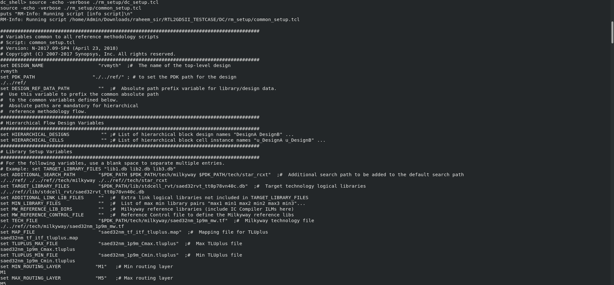
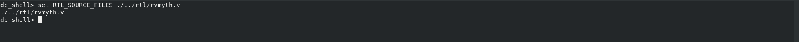
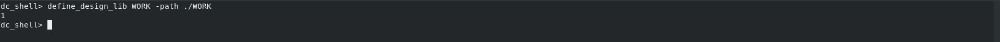
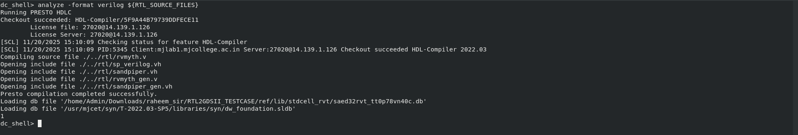
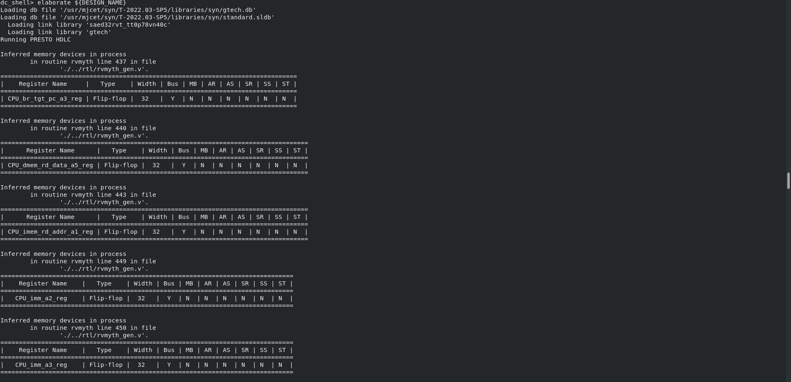
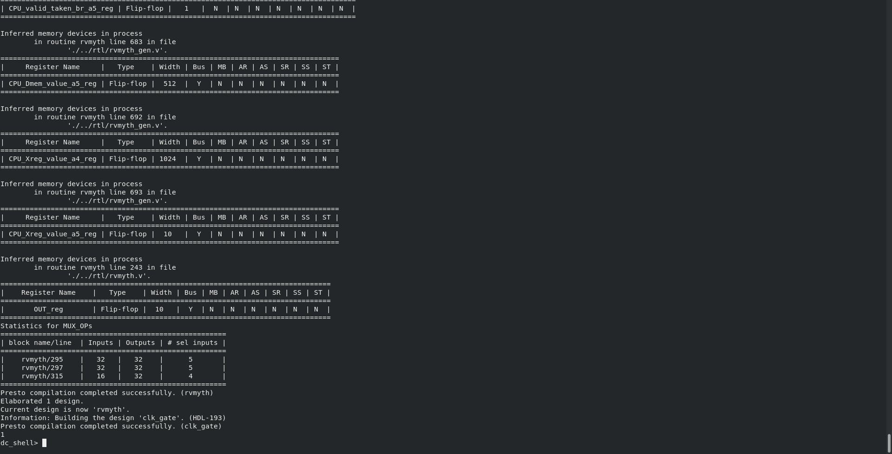
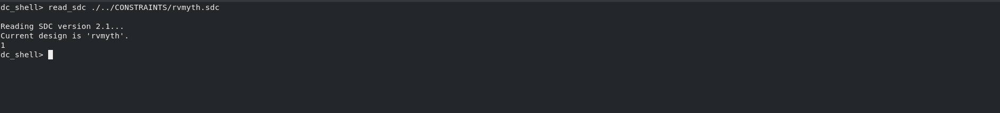
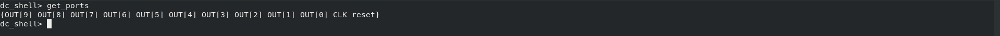
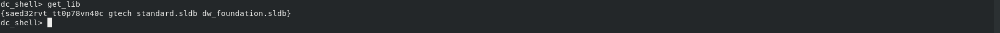
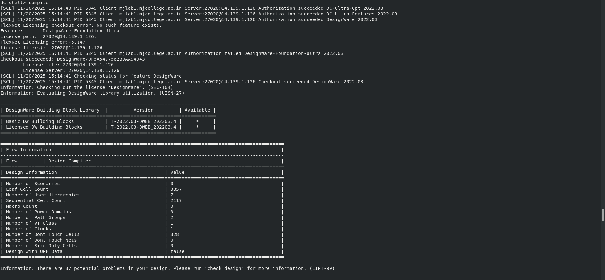

### Sample Output 1
Runs the dc_setup.tcl script with echoing and verbose output for setup.

### Sample Output 2
Defines a variable RTL_SOURCE_FILES with the path to the Verilog RTL file.

### Sample Output 3
Defines a design library WORK with its path set to ./WORK.

### Sample Output 4
Analyzes the Verilog RTL files specified in RTL_SOURCE_FILES.

### Sample Output 5
Elaborates the design for synthesis, where ${DESIGN_NAME} is the top-level module.

### Sample Output 6
Report of Elaborates 

### Sample Output 7
Reads the Synopsys Design Constraints (SDC) file for timing and physical constraints.

### Sample Output 8
Lists all the input/output ports of the design after elaboration.

### Sample Output 9
Lists the libraries (e.g., standard cell libraries) used in the design.

### Sample Output 10
Asks whether to use compile (standard) or compile_ultra (more aggressive optimization).

