# Table of contents

- [Week 7 Task – BabySoC Physical Design & Post-Route SPEF Generation](#week-7-task--babysoc-physical-design--post-route-spef-generation)
- [Floorplan and Placement of VSDBabySoC in OpenROAD](#floorplan-and-placement-of-vsdbabysoc-in-openroad)
- [Macro Configuration File Documentation](#macro-configuration-file-documentation)
- [This proc is here to allow us to use 'return' to return early from this](#this-proc-is-here-to-allow-us-to-use-return-to-return-early-from-this)
- [file which is sourced](#file-which-is-sourced)
- [Repair design using global route parasitics](#repair-design-using-global-route-parasitics)
- [Running DPL to fix overlapped instances](#running-dpl-to-fix-overlapped-instances)
- [Run to get modified net by DPL](#run-to-get-modified-net-by-dpl)
- [Route only the modified net by DPL](#route-only-the-modified-net-by-dpl)
- [Repair timing using global route parasitics](#repair-timing-using-global-route-parasitics)
- [Running DPL to fix overlapped instances](#running-dpl-to-fix-overlapped-instances)
- [Run to get modified net by DPL](#run-to-get-modified-net-by-dpl)
- [Route only the modified net by DPL](#route-only-the-modified-net-by-dpl)
- [log_cmd global_route -start_incremental](#log_cmd-global_route--start_incremental)
- [recover_power_helper](#recover_power_helper)
- [Route the modified nets by rsz journal restore](#route-the-modified-nets-by-rsz-journal-restore)
- [global_routing fix](#log_cmd-global_route--end_incremental-res_aware-)
- [Write SDC to results with updated clock periods that are just failing.](#write-sdc-to-results-with-updated-clock-periods-that-are-just-failing)
- [Use make target update_sdc_clock to install the updated sdc.](#use-make-target-update_sdc_clock-to-install-the-updated-sdc)

# Week 7 Task – BabySoC Physical Design & Post-Route SPEF Generation

This document presents the complete physical design implementation of the BabySoC using OpenROAD, covering all stages from floorplanning to post-route parasitic extraction (SPEF generation). The objective of this task is to integrate the theoretical and practical aspects of digital design by executing a full RTL-to-GDSII flow on a real System-on-Chip (SoC).

Through this exercise, the BabySoC design undergoes floorplan definition, standard cell placement, routing, and parasitic extraction to reflect a realistic ASIC design process. Each stage is explored to understand how physical parameters—such as floorplan constraints, placement density, and routing topology—affect timing performance and design closure.

The outcome of this work is a fully placed and routed BabySoC layout, accompanied by a generated SPEF file that enables post-route Static Timing Analysis (STA). This provides insight into how parasitic effects influence signal delay and how accurate timing verification is performed in professional VLSI design environments.

Comprehensive screenshots, step-by-step procedures, and observations are documented to demonstrate the design flow, tools used, challenges encountered, and verification results.

### Setup and Prepare Project Directory
Clone or set up the directory structure as follows:
```txt
VSDBabySoC/
├── src/
│   ├── include/
│   │   ├── sandpiper.vh
│   │   └── other header files...
│   ├── module/
│   │   ├── vsdbabysoc.v      # Top-level module integrating all components
│   │   ├── rvmyth.v          # RISC-V core module
│   │   ├── avsdpll.v         # PLL module
│   │   ├── avsddac.v         # DAC module
│   │   └── testbench.v       # Testbench for simulation
└── output/
└── compiled_tlv/         # Holds compiled intermediate files if needed
```

### 🛠️ Cloning the Project

To begin, clone the VSDBabySoC repository using the following command:

```bash
cd ~/VLSI
git clone https://github.com/manili/VSDBabySoC.git
cd ~/VLSI/VSDBabySoC/
```


### TLV to Verilog Conversion for RVMYTH

Initially, you will see only the `rvmyth.tlv` file inside `src/module/`, since the RVMYTH core is written in TL-Verilog.

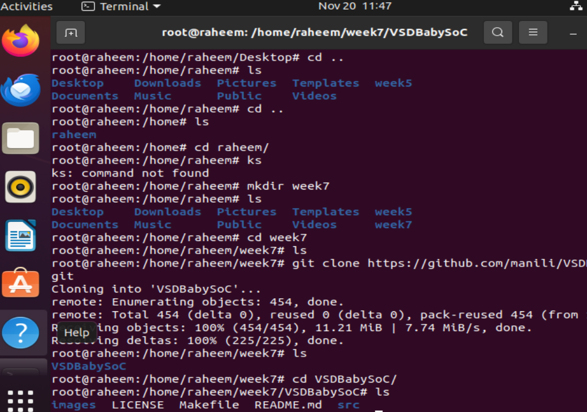
To convert it into a `.v` file for simulation, follow the steps below:

<strong>🔧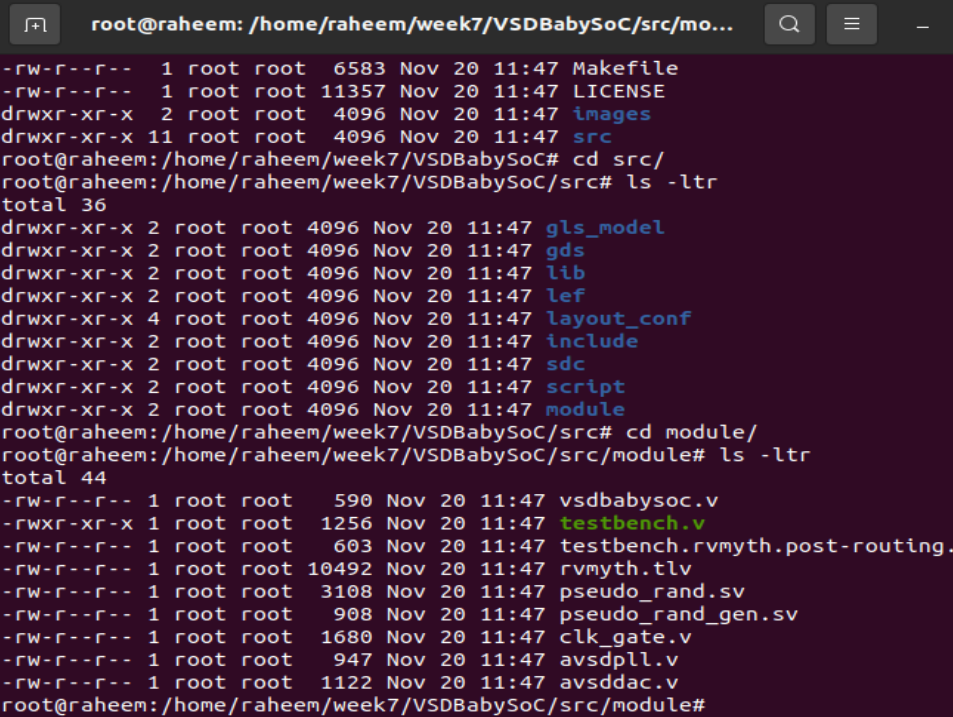</strong>

```bash
# Step 1: Install python3-venv (if not already installed)
sudo apt update
sudo apt install python3-venv python3-pip
```

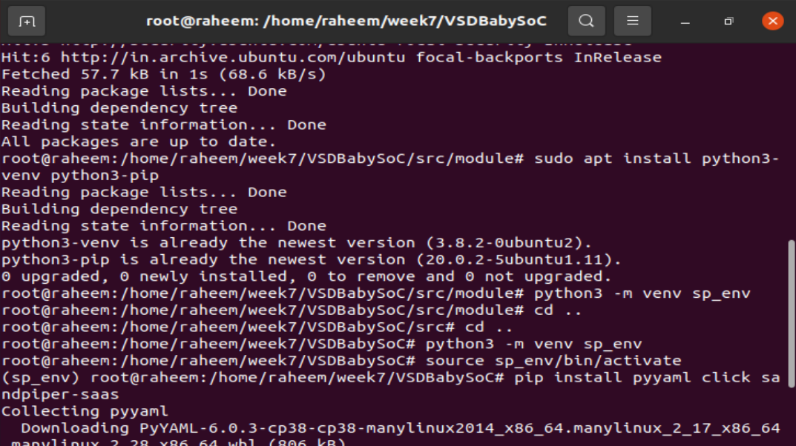
```
# Step 2: Create and activate a virtual environment
cd ~/VLSI/VSDBabySoC/
python3 -m venv sp_env
source sp_env/bin/activate
```

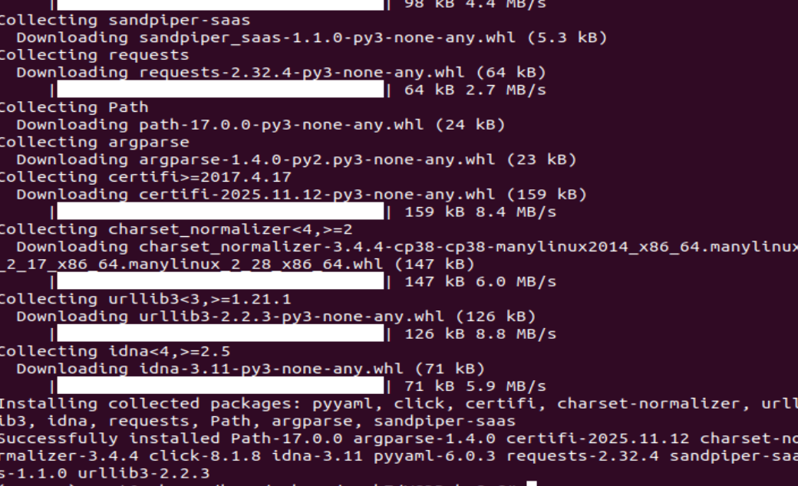

```
# Step 3: Install SandPiper-SaaS inside the virtual environment
pip install pyyaml click sandpiper-saas
```

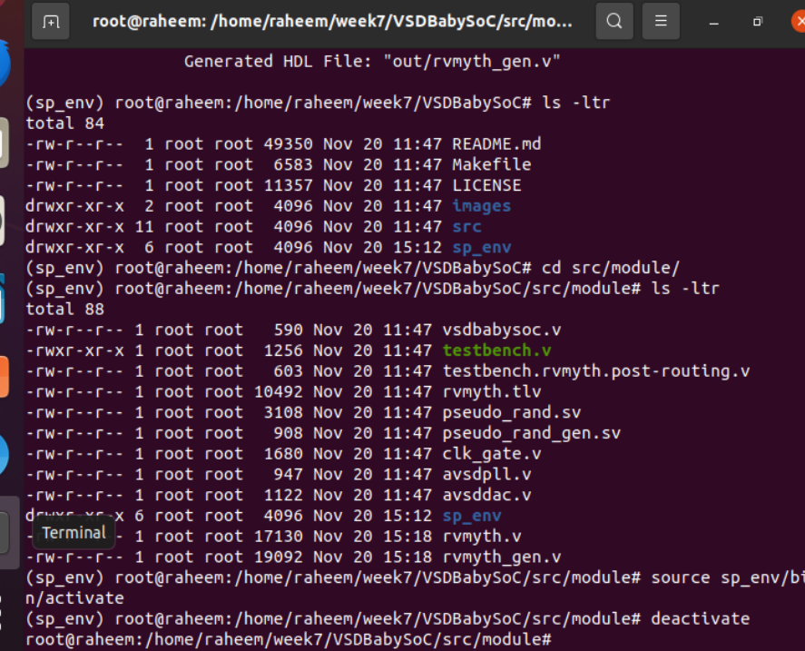
```
# Step 4: Convert rvmyth.tlv to Verilog
sandpiper-saas -i ./src/module/*.tlv -o rvmyth.v --bestsv --noline -p verilog --outdir ./src/module/
```

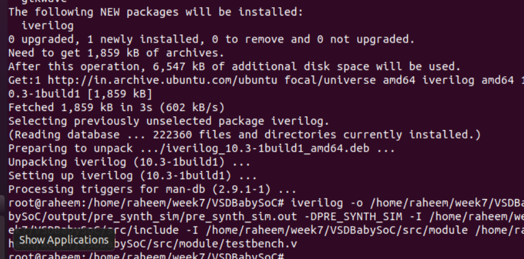
✅ After running the above command, rvmyth.v will be generated in the src/module/ directory.

You can confirm this by listing the files:

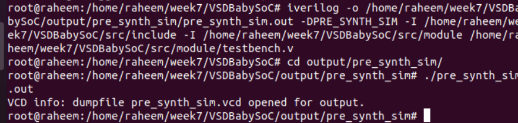

#### Note 
To use this environment in future sessions, always activate it first:
```bash
source sp_env/bin/activate
```
To exit:
```bash
deactivate
```
### Simulation Steps

#### <ins>Pre-Synthesis Simulation</ins>

Run the following command to perform a pre-synthesis simulation:

```bash
cd ~/VLSI/VSDBabySoC/
mkdir -p output/pre_synth_sim
iverilog -o ~/Desktop/VLSI/VSDBabySoC/output/pre_synth_sim/pre_synth_sim.out -DPRE_SYNTH_SIM -I ~/Desktop/VLSI/VSDBabySoC/src/include -I ~/Desktop/VLSI/VSDBabySoC/src/module ~/Desktop/VLSI/VSDBabySoC/src/module/testbench.v
```
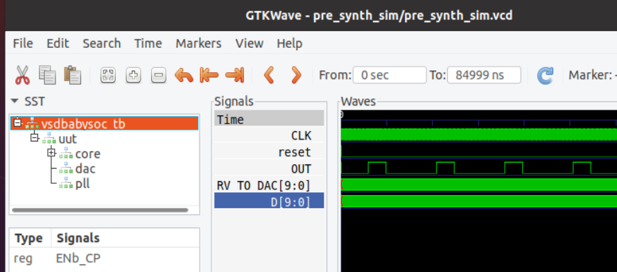
Then run:
```bash
cd output/pre_synth_sim
./pre_synth_sim.out
```
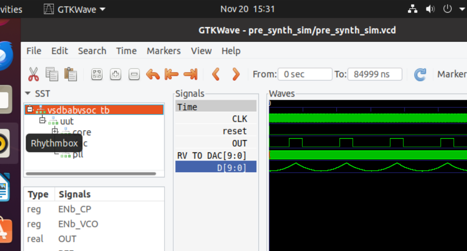

Explanation:

- DPRE_SYNTH_SIM: Defines the PRE_SYNTH_SIM macro for conditional compilation in the testbench.
- The resulting pre_synth_sim.vcd file can be viewed in GTKWave.

#### Viewing Waveform in GTKWave

After running the simulation, open the VCD file in GTKWave: 

```bash

cd ~/VLSI/VSDBabySoC/
gtkwave output/pre_synth_sim/pre_synth_sim.vcd

```
Drag and drop the CLK, reset, OUT (DAC), and RV TO DAC [9:0] signals to their respective locations in the simulation tool

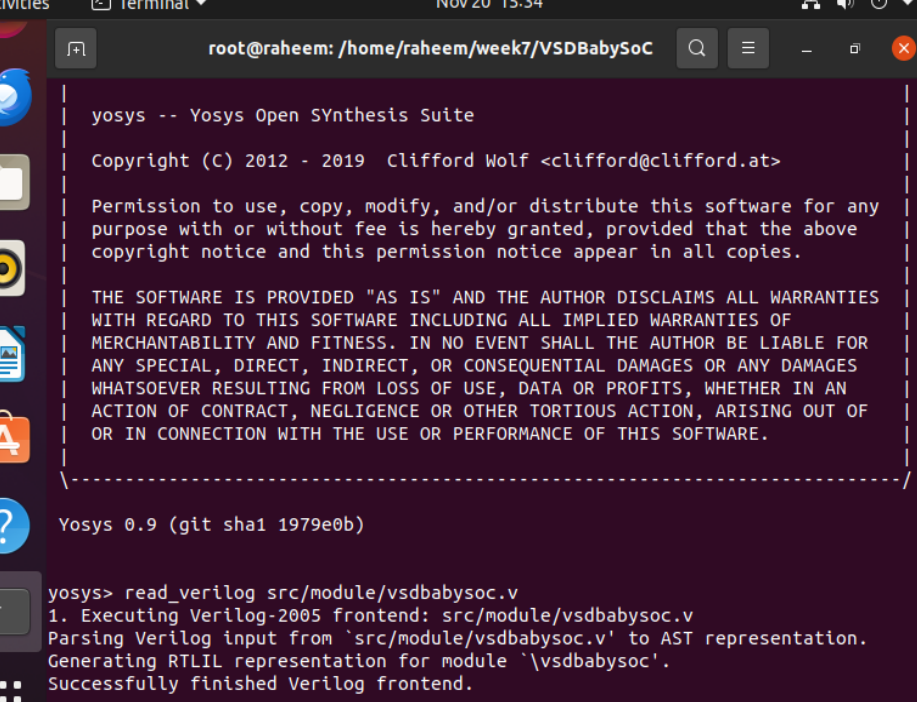
In this picture we can see the following signals:

**CLK**: This is the input CLK signal of the RVMYTH core. This signal comes from the PLL, originally.

**reset**: This is the input reset signal of the RVMYTH core. This signal comes from an external source, originally.

**OUT**: This is the output OUT signal of the VSDBabySoC module. This signal comes from the DAC (due to simulation restrictions it behaves like a digital signal which is incorrect), originally.

**RV_TO_DAC[9:0]**: This is the 10-bit output [9:0] OUT port of the RVMYTH core. This port comes from the RVMYTH register #17, originally.

**OUT**: This is a real datatype wire which can simulate analog values. It is the output wire real OUT signal of the DAC module. This signal comes from the DAC, originally. 

This can be viewed by changing the Data Format of the signal to Analog → Step

#### Viewing DAC output in analog mode

Drag and drop the CLK, reset, OUT (DAC) (as analog step), and RV TO DAC [9:0] signals to their respective locations in the simulation tool 

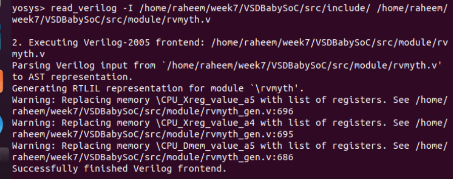
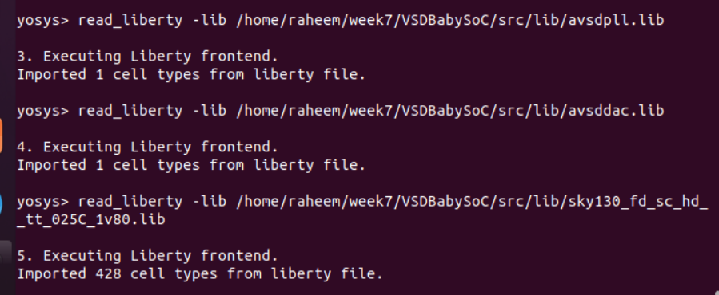

### Trouble shooting tips

   - Module Redefinition: If you encounter redefinition errors, ensure modules are included only once, either in the testbench or in the command line.
   - Path Issues: Verify paths specified with -I are correct. Use full paths if relative paths cause errors.

## Why Pre-Synthesis and Post-Synthesis?

1. **Pre-Synthesis Simulation**: 
   - Focuses only on verifying functionality based on the RTL code.
   - Zero-delay environment, with events occurring on the active clock edge.

2. **Post-Synthesis Simulation (GLS)**:
   - Uses the synthesized netlist (gate-level) to simulate both functionality and timing.
   - Identifies timing violations and potential mismatches (e.g., unintended latches).
   - Helps verify dynamic circuit behavior that static methods may miss.

## VSDBabySoC Post-Synthesis Simulation

Post-synthesis simulation is a critical step in the digital design flow, providing insights into both the functionality and timing of the synthesized design. 

Unlike pre-synthesis simulation, which focuses solely on verifying the functionality based on the RTL code, post-synthesis simulation uses the synthesized netlist to ensure that the design behaves correctly in terms of both logic and timing.

Key aspects of post-synthesis simulation include:

**Functionality and Timing Verification**: It checks the design's functionality and timing using the gate-level netlist, helping identify timing violations and potential mismatches such as unintended latches.

**Dynamic Circuit Behavior**: Post-synthesis simulation can reveal dynamic circuit behaviors that static methods might miss, ensuring the design operates correctly under real-world conditions.

**Identifying Issues**: It helps in identifying issues that may not be apparent in pre-synthesis simulations, such as glitches or race conditions due to the actual gate delays.

The first step in the design flow is to synthesize the generated RTL code, followed by simulating the result. This process helps uncover more about the code and its potential bugs. In this section, we will synthesize our code and then perform a post-synthesis simulation to look for any issues. Ideally, the post-synthesis and pre-synthesis (modeling section) results should be identical, confirming that the synthesis process has not altered the original design behavior.

#### Why do pre-synthesis simulation? Why not just do post-synthesis simulation?
Pre-synthesis simulation is crucial for verifying the logical functionality of a digital design before it undergoes synthesis. It allows designers to detect and correct logical errors, such as incorrect operator usage or unintended latch inference, early in the development process. This type of simulation focuses solely on the high-level behavior of the design, enabling faster iterations and design exploration without the constraints of gate-level details. On the other hand, post-synthesis simulation, or gate-level simulation, is essential for timing verification and ensuring that the synthesized design meets real-world performance requirements. It accounts for gate delays and helps identify any synthesis-induced issues, providing a final validation of both functionality and timing before the design is implemented in hardware. Together, these simulations ensure a robust and reliable digital design.

Here is the step-by-step execution plan for running the  commands manually:
---
### **Step 1: Load the Top-Level Design and Supporting Modules**
- Launch the yosys synthesis tool from your working directory.
```bash
yosys
```
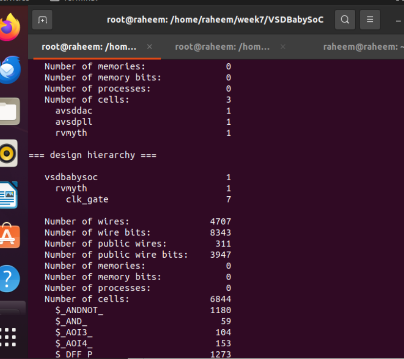
- Read the main vsdbabysoc.v RTL file into the yosys environment.
```bash
yosys> read_verilog src/module/vsdbabysoc.v 
```
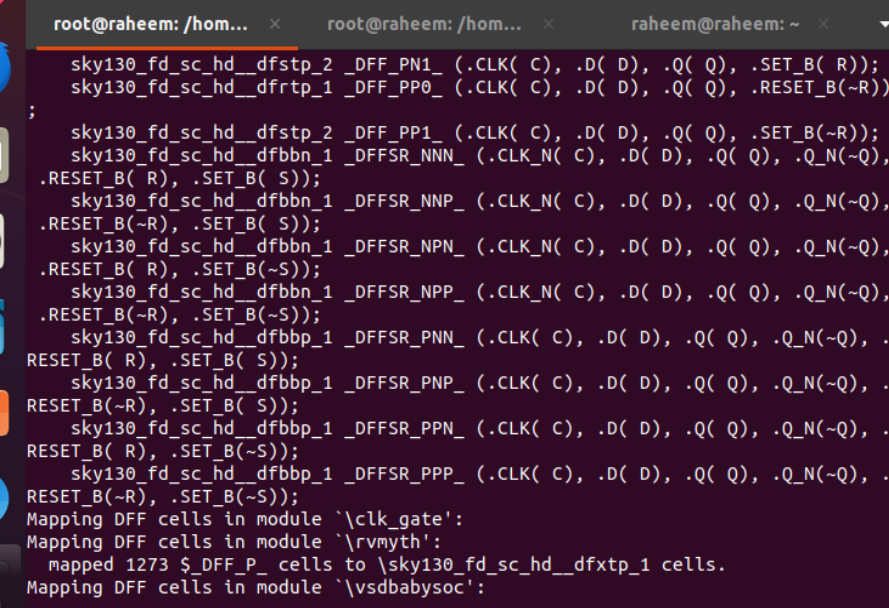
- The following cp commands copy essential header files from the src/include directory into the working directory. These include:

  **sp_verilog.vh** – contains Verilog definitions and macros

  **sandpiper.vh** – holds integration-related definitions for SandPiper

  **sandpiper_gen.vh** – may include auto-generated or tool-generated parameters

```bash
cd ~/Desktop/VLSI/VSDBabySoC
cp -r src/include/sp_verilog.vh .
cp -r src/include/sandpiper.vh .
cp -r src/include/sandpiper_gen.vh .
ls
```

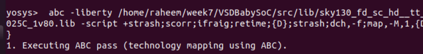
- Read the rvmyth.v file with the include path using -I option.
```bash
yosys> read_verilog -I ~/Desktop/VLSI/VSDBabySoC/src/include/ ~/Desktop/VLSI/VSDBabySoC/src/module/rvmyth.v
```
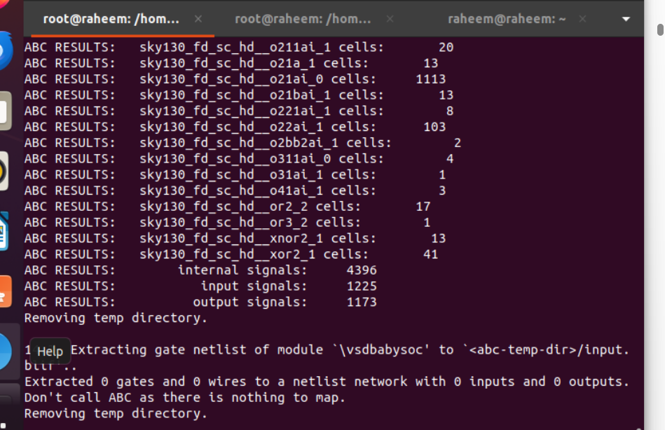

#### ❗Note:

_If you try to read the rvmyth.v file using yosys without copying the necessary header files first, you may encounter errors.

_To avoid these errors, make sure to copy the required include files into your working directory! This ensures Yosys can resolve them correctly during parsing, even if the -I option is used._

- Read the clk_gate.v file with the include path using -I option.

```bash
yosys> read_verilog -I ~/Desktop/VLSI/VSDBabySoC/src/include/ ~/Desktop/VLSI/VSDBabySoC/src/module/clk_gate.v
```

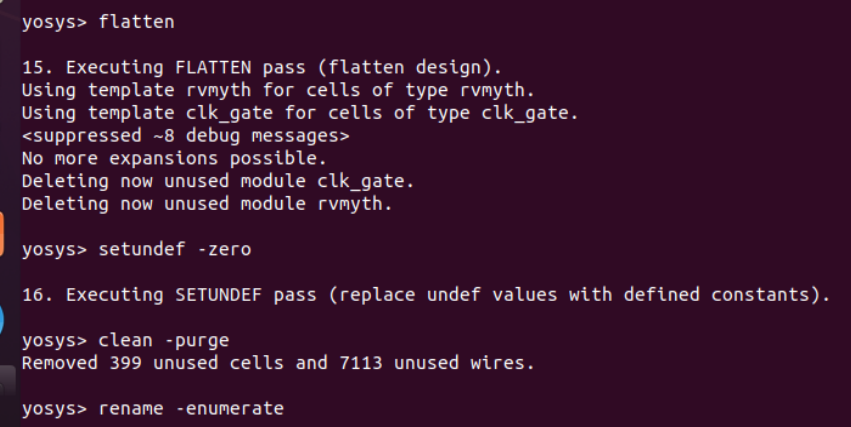
### **Step 2: Load the Liberty Files for Synthesis**
Inside the same yosys shell, run:
```bash
read_liberty -lib ~/Desktop/VLSI/VSDBabySoC/src/lib/avsdpll.lib 
read_liberty -lib ~/Desktop/VLSI/VSDBabySoC/src/lib/avsddac.lib 
read_liberty -lib ~/Desktop/VLSI/VSDBabySoC/src/lib/sky130_fd_sc_hd__tt_025C_1v80.lib
```
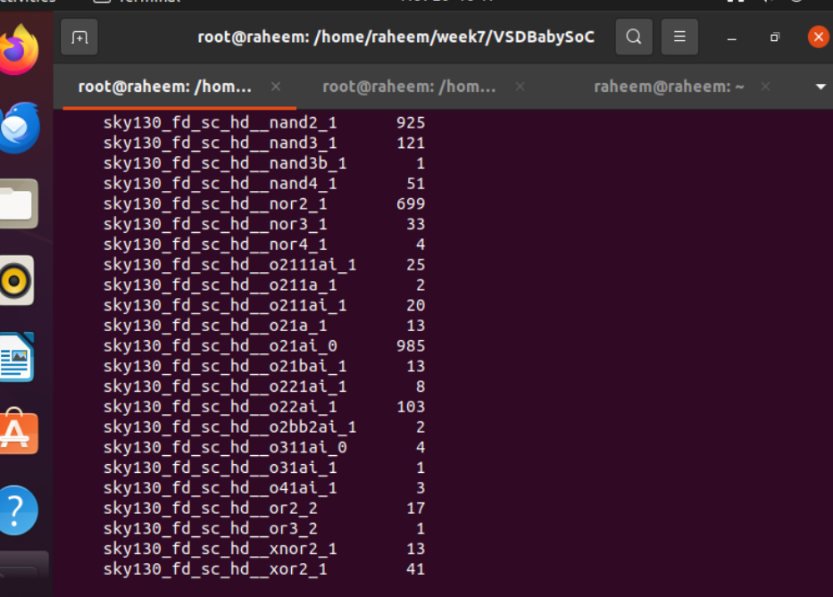
### **Step 3: Run Synthesis Targeting `vsdbabysoc`**
```bash
yosys> synth -top vsdbabysoc
```

### **Step 4: Map D Flip-Flops to Standard Cells**

```bash
yosys> dfflibmap -liberty ~/Desktop/VLSI/VSDBabySoC/src/lib/sky130_fd_sc_hd__tt_025C_1v80.lib
```

### **Step 5: Perform Optimization and Technology Mapping**
```bash
yosys> opt
yosys> abc -liberty ~/Desktop/VLSI/VSDBabySoC/src/lib/sky130_fd_sc_hd__tt_025C_1v80.lib -script +strash;scorr;ifraig;retime;{D};strash;dch,-f;map,-M,1,{D}
```

| Step           | Purpose                                                              |
| -------------- | -------------------------------------------------------------------- |
| `strash`       | Structural hashing (reduces logic redundancy)                        |
| `scorr`        | Sequential sweeping for redundancy removal                           |
| `ifraig`       | Incremental FRAIGing (logic equivalence checking and optimization)   |
| `retime;{D}`   | Move registers across combinational logic to optimize timing         |
| `strash`       | Re-run structural hashing after retiming                             |
| `dch,-f`       | Delay-aware combinational optimization with fast mode                |
| `map,-M,1,{D}` | Map logic to gates minimizing area (`-M,1`) and retime-aware (`{D}`) |


### **Step 6: Perform Final Clean-Up and Renaming**

```bash
yosys> flatten
yosys> setundef -zero
yosys> clean -purge
yosys> rename -enumerate
```
| **Command**         | **Purpose / Usage**                                                                    |
| ------------------- | -------------------------------------------------------------------------------------- |
| `flatten`           | Flattens the entire design hierarchy into a single-level netlist.                      |
| `setundef -zero`    | Replaces all undefined (`x`) logic values with logical `0` to avoid simulation issues. |
| `clean -purge`      | Removes all unused wires, cells, and modules; `-purge` makes it more aggressive.       |
| `rename -enumerate` | Renames internal wires and cells to unique, numbered names for consistency.            |

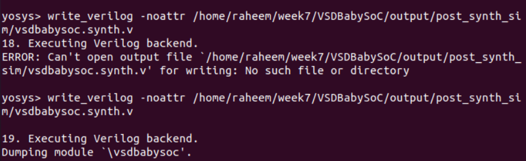

### **Step 7: Check Statistics**
```bash
yosys> stat
```
13. Printing statistics.
```shell
=== vsdbabysoc ===

   Number of wires:               4709
   Number of wire bits:           6183
   Number of public wires:        4709
   Number of public wire bits:    6183
   Number of memories:               0
   Number of memory bits:            0
   Number of processes:              0
   Number of cells:               5885
     avsddac                         1
     avsdpll                         1
     sky130_fd_sc_hd__a2111oi_0      8
     sky130_fd_sc_hd__a211oi_1      12
     sky130_fd_sc_hd__a21boi_0       3
     sky130_fd_sc_hd__a21o_2         4
     sky130_fd_sc_hd__a21oi_1      682
     sky130_fd_sc_hd__a221oi_1     165
     sky130_fd_sc_hd__a22oi_1      133
     sky130_fd_sc_hd__a311oi_1       8
     sky130_fd_sc_hd__a31oi_1      333
     sky130_fd_sc_hd__a32o_1         1
     sky130_fd_sc_hd__a32oi_1        2
     sky130_fd_sc_hd__a41oi_1       13
     sky130_fd_sc_hd__and2_2         3
     sky130_fd_sc_hd__and3_2         1
     sky130_fd_sc_hd__clkinv_1     579
     sky130_fd_sc_hd__dfxtp_1     1144
     sky130_fd_sc_hd__lpflow_inputiso0p_1      1
     sky130_fd_sc_hd__mux2i_1       11
     sky130_fd_sc_hd__nand2_1      823
     sky130_fd_sc_hd__nand3_1      278
     sky130_fd_sc_hd__nand3b_1       1
     sky130_fd_sc_hd__nand4_1       48
     sky130_fd_sc_hd__nor2_1       388
     sky130_fd_sc_hd__nor3_1        33
     sky130_fd_sc_hd__nor3b_1        1
     sky130_fd_sc_hd__nor4_1         6
     sky130_fd_sc_hd__o2111a_1       2
     sky130_fd_sc_hd__o2111ai_1     24
     sky130_fd_sc_hd__o211ai_1      48
     sky130_fd_sc_hd__o21a_1         8
     sky130_fd_sc_hd__o21ai_0      867
     sky130_fd_sc_hd__o21bai_1      13
     sky130_fd_sc_hd__o221ai_1       6
     sky130_fd_sc_hd__o22ai_1      154
     sky130_fd_sc_hd__o311ai_0       4
     sky130_fd_sc_hd__o31ai_1        1
     sky130_fd_sc_hd__o41ai_1        2
     sky130_fd_sc_hd__or2_2         14
     sky130_fd_sc_hd__or4_2          1
     sky130_fd_sc_hd__xnor2_1       16
     sky130_fd_sc_hd__xor2_1        42
```

### **Step 8: Write the Synthesized Netlist**
```bash

yosys> write_verilog -noattr ~/Desktop/VLSI/VSDBabySoC/output/post_synth_sim/vsdbabysoc.synth.v
```
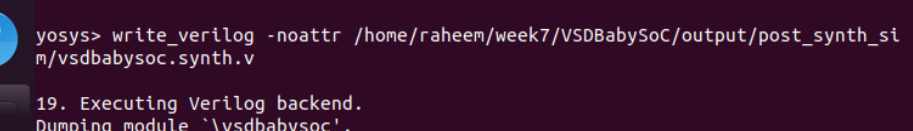
Comparing Pre-Synthesis and Post-Synthesis Output
To ensure that the synthesis process did not alter the original design behavior, the output from the pre-synthesis simulation was compared with the post-synthesis simulation.

Both simulations were run using GTKWave, and the resulting waveforms were observed.

✅ The outputs match exactly, confirming that the functionality is preserved across the synthesis flow.

This validates that the synthesized netlist is functionally equivalent to the RTL design.

Timing Graphs using openSTA
Input Files
*.v : Gate-level Verilog Netlist
*.lib : Liberty Timing Libraries
*.sdc : Synopsys Design Constraints (clocks, delays, false paths)
*.sdf : Annotated Delay File (optional)
*.spef: Parasitics (RC extraction)
*.vcd / *.saif : Switching Activity for Power Analysis
Clock Modeling Features
Generated Clocks: Derived from existing clocks
Latency: Clock propagation delay
Source Latency: Insertion delay from clock source to input
Uncertainty: Jitter or skew margins
Propagated vs. Ideal: Real vs. ideal clock network modeling
Gated Clock Checks: Verifies clocks that are enabled conditionally
Multi-Frequency Clocks: Analyzes multiple domains
Exception Paths
Timing exceptions refine analysis for real behavior:

set_false_path — Ignores invalid functional paths
set_multicycle_path — Allows multiple clock cycles
set_max_delay / set_min_delay — Custom timing limits
Delay calculation
Integrated Dartu/Menezes/Pileggi RC effective capacitance algorithm
Models effective capacitance for RC networks to compute realistic gate and net delays. It balances accuracy and runtime using an efficient algorithm developed for timing engines.

External delay calculator API
Allows plugging in custom delay calculators for advanced or proprietary models (e.g., layout-aware or temperature-adaptive models). Useful for integrating tool flows beyond standard Liberty data.

Timing Analysis and Reporting
OpenSTA provides a rich set of commands for analyzing timing paths, delays, and setup/hold checks:

report_checks
Reports timing violations across specified paths using options like -from, -through, and -to. Supports multi-path analysis to any endpoint.

report_checks -from [get_pins U1/Q] -to [get_pins U2/D]
Timing Paths
What do you mean by Timing Paths?

It Refer to the logical paths a signal takes through a digital circuit from its source to its destination, including sequential and combinational elements. STA analyzes timing paths to determine their delay, setup and hold times, and other timing parameters specified in the constraints. Timing paths are categorized into combinatorial and sequential, and the critical path is the longest path in the design with the maximum operating frequency.
Timing Path Elements
Timing path elements in STA are the start point, where a signal originates, the end point, where it terminates, and the combinational logic elements, such as gates, that the signal passes through. Timing paths are traced to determine the overall delay and timing performance of the digital circuit.

Start Point: Is the point where the signal originates or enters the digital circuit. This point is typically an input port of the design, where the signal is first introduced to the circuit.

The start point of a timing path can be either:

An input port, where data enters the design, or

The clock pin of a register, where data is launched on a clock edge.

End Point: Is the point where the signal terminates or leaves the digital circuit. This point is typically an output port of the design, where the signal is outputted from the circuit.

The end point of a timing path can be either:

A register's data input pin (D pin), where data is captured by the clock edge, or

An output port, where data must be available at a specific time.

Combinational Logic: Combinational logic elements are the building blocks of a digital circuit and are used to perform logic operations on the signals passing through the circuit. These elements do not store any information, and the output of a combinational logic element is solely determined by the input values at that moment.

The diagram illustrates four distinct timing paths:

Path 1: Input to Register (in2reg)

Path 2: Register to Register (reg2reg)

Path 3: Register to Output (reg2out)

Path 4: Input to Output (in2out)
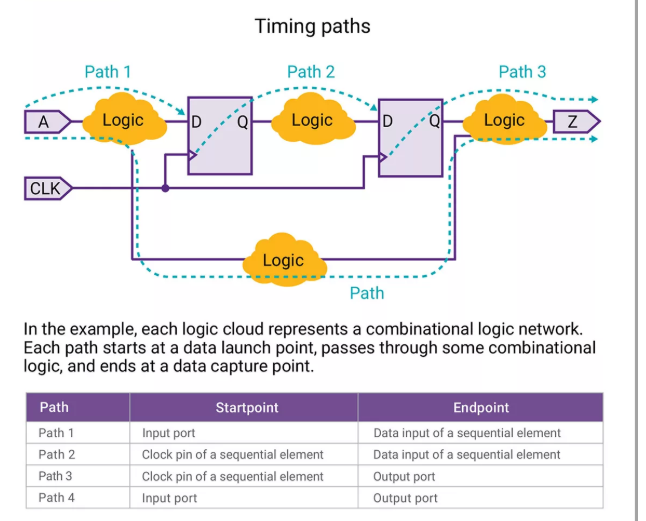
Setup and Hold Checks
-> What is Setup Check?

Is the minimum time that the data must be stable before the clock edge, and if this time is not met, it can lead to setup violations, resulting in incorrect data being stored in the sequential element. The setup check is essential to ensure correct timing behavior of a digital circuit and prevent data loss or other timing-related issues.
The setup time of a flip-flop depends on the technology node, operating conditions, and other factors. The value of the setup time is usually provided in the logic libraries.
-> What is Hold Check?

Is the minimum amount of time that the data must remain stable after the clock edge, and if this time is not met, it can lead to hold violations, resulting in incorrect data being stored in the sequential element. The hold check is necessary to prevent issues such as data corruption, metastability, and other timing-related problems in digital circuits.
Slack Calculation
Setup and hold slack is defined as the difference between data required time and data arrivals time.

Setup slack = Data required time - Data arrival time

Hold slack = Data arrival time - Data required time

-> What is Data Arrival Time?

The time taken by the signal to travel from the start point to the end point of the digital circuit.
-> What is Data Required Time?

The time for the clock to traverse through the clock path of the digital circuit.
-> What is Slack?

It is difference between the desired arrival times and the actual arrival time for a signal.
Positive Slack indicates that the design is meeting the timing and still it can be improved.
Zero slack means that the design is critically working at the desired frequency.
Negative slack means, design has not achieved the specified timings at the specified frequency.
Slack has to be positive always and negative slack indicates a violation in timing.
Common SDC Constraints
In Static Timing Analysis (STA), Synopsys Design Constraints (SDC) are used to define the behavior, environment, and timing requirements of a digital design. These constraints are categorized based on their function and purpose.

Operating Conditions are set using the set_operating_conditions command, which defines the process-voltage-temperature (PVT) corner used during analysis.

Wire-Load Models such as set_wire_load_mode, set_wire_load_model, and set_wire_load_selection_group are used to estimate interconnect capacitance and resistance based on fanout and hierarchy when post-layout parasitics are unavailable.

Environmental Constraints define the electrical behavior of I/Os. The set_drive and set_driving_cell commands model input driving strength or source cell characteristics. Output loads are described using set_load or set_fanout_load. Additional attributes like set_input_transition (input slew) and set_port_fanout_number (expected output fanout) further refine environment models.

Design Rule Constraints ensure physical design adherence. These include set_max_capacitance to limit load, set_max_fanout to cap number of loads, and set_max_transition to restrict slew for signal integrity and EM/IR compliance.

Timing Constraints are the core of STA. create_clock defines primary clocks, while create_generated_clock handles derived clocks. Clock behavior is further detailed using set_clock_latency, set_clock_transition, and set_clock_uncertainty. Timing analysis can be guided with set_propagated_clock to consider actual delays, or set_disable_timing to ignore specific paths.

Signal timing is modeled using set_input_delay and set_output_delay. The set_input_delay command specifies when input data arrives relative to the clock edge, crucial for setup/hold timing analysis. The set_output_delay command defines the required time by which output signals must be valid, helping STA tools verify that data is launched and captured within acceptable timing windows.

Timing Exceptions allow control over non-functional or multi-cycle paths. set_false_path removes paths from analysis, set_max_delay restricts path delay, and set_multicycle_path increases the allowed number of clock cycles for timing paths that do not need single-cycle timing closure.

Lastly, Power Constraints help manage dynamic and leakage power budgets using set_max_dynamic_power and set_max_leakage_power. These are especially useful in power-aware synthesis and verification flows.

Installation of OpenSTA
Note: Installation instructions are adapted from the official OpenSTA repository: 🔗 https://github.com/parallaxsw/OpenSTA

Step 1: Clone the Repository
git clone https://github.com/parallaxsw/OpenSTA.git
cd OpenSTA
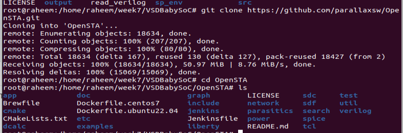

Step 2: Build the Docker Image
\docker build --file Dockerfile.ubuntu22.04 --tag opensta .
This builds a Docker image named opensta using the provided Ubuntu 22.04 Dockerfile. All dependencies are installed during this step.

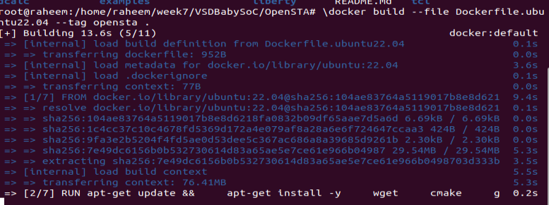
Step 3: Run the OpenSTA Container
To run a docker container using the OpenSTA image, use the -v option to docker to mount direcories with data to use and -i to run interactively.

\docker run -i -v $HOME:/data opensta
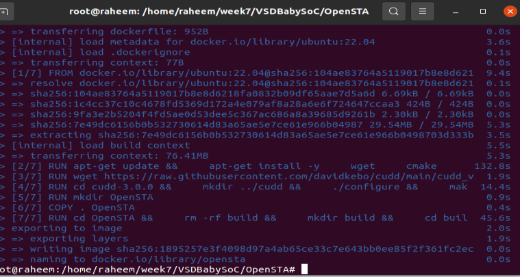
You now have OpenSTA installed and running inside a Docker container. After successful installation, you will see the % prompt—this indicates that the OpenSTA interactive shell is ready for use.

VSDBabySoC basic timing analysis
Prepare Required Files
To begin static timing analysis on the VSDBabySoC design, you must organize and prepare the required files in specific directories.

# Create a directory to store Liberty timing libraries
~/Desktop/VLSI/VSDBabySoC/OpenSTA$ mkdir -p examples/timing_libs/
~/Desktop/VLSI/VSDBabySoC/OpenSTA/examples$ ls timing_libs/
avsddac.lib  avsdpll.lib  sky130_fd_sc_hd__tt_025C_1v80.lib
# Create a directory to store synthesized netlist and constraint files
~/Desktop/VLSI/VSDBabySoC/OpenSTA$ mkdir -p examples/BabySoC
~/Desktop/VLSI/VSDBabySoC/OpenSTA/examples$ ls BabySoC/
gcd_sky130hd.sdc vsdbabysoc_synthesis.sdc  vsdbabysoc.synth.v
These files include:

Standard cell library: sky130_fd_sc_hd__tt_025C_1v80.lib

IP-specific Liberty libraries: avsdpll.lib, avsddac.lib

Synthesized gate-level netlist: vsdbabysoc.synth.v

Timing constraints: vsdbabysoc_synthesis.sdc

These files include:

Standard cell library: sky130_fd_sc_hd__tt_025C_1v80.lib

IP-specific Liberty libraries: avsdpll.lib, avsddac.lib

Synthesized gate-level netlist: vsdbabysoc.synth.v

Timing constraints: vsdbabysoc_synthesis.sdc

Below is the TCL script to run complete min/max timing checks on the SoC:

vsdbabysoc_min_max_delays.tcl
Line of Code	Purpose	Explanation
read_liberty -min ...sky130... & -max ...sky130...	Load standard cell library	Loads the typical PVT corner for both min (hold) and max (setup) timing analysis.
read_liberty -min/-max avsdpll.lib	Load PLL IP Liberty	Includes Liberty timing views of the PLL IP used in the design.
read_liberty -min/-max avsddac.lib	Load DAC IP Liberty	Includes Liberty timing views of the DAC IP used in the design.
read_verilog vsdbabysoc.synth.v	Load synthesized netlist	Loads the gate-level Verilog netlist of the VSDBabySoC design.
link_design vsdbabysoc	Link top-level module	Links the hierarchy using vsdbabysoc as the top module for timing analysis.
read_sdc vsdbabysoc_synthesis.sdc	Load constraints	Loads SDC file specifying clock definitions, input/output delays, and false paths.
report_checks	Run timing analysis	Generates a default setup timing report. Add -path_delay min_max to see both hold and setup.
execute it inside the Docker container:

\docker run -it -v $HOME:/data opensta /data/VLSI/VSDBabySoC/OpenSTA/examples/BabySoC/vsdbabysoc_min_max_delays.tcl
⚠️ Possible Error Alert

You may encounter the following error when running the script:

Warning: /data/Desktop/VLSI/VSDBabySoC/OpenSTA/examples/timing_libs/sky130_fd_sc_hd__tt_025C_1v80.lib line 23, default_fanout_load is 0.0.
Warning: /data/Desktop/VLSI/VSDBabySoC/OpenSTA/examples/timing_libs/sky130_fd_sc_hd__tt_025C_1v80.lib line 1, library sky130_fd_sc_hd__tt_025C_1v80 already exists.
Warning: /data/Desktop/VLSI/VSDBabySoC/OpenSTA/examples/timing_libs/sky130_fd_sc_hd__tt_025C_1v80.lib line 23, default_fanout_load is 0.0.
Error: /data/Desktop/VLSI/VSDBabySoC/OpenSTA/examples/timing_libs/avsdpll.lib line 54, syntax error
✅ Fix:

This error occurs because Liberty syntax does not support // for single-line comments, and more importantly, the { character appearing after // confuses the Liberty parser. Specifically, check around line 54 of avsdpll.lib and correct any syntax issues such as:

//pin (GND#2) {
//  direction : input;
//  max_transition : 2.5;
//  capacitance : 0.001;
//}
✔️ Replace with:

/*
pin (GND#2) {
  direction : input;
  max_transition : 2.5;
  capacitance : 0.001;
}
*/


After fixing the Liberty file comment syntax as shown above, you can rerun the script to perform complete timing analysis for VSDBabySoC:

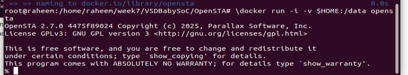

VSDBabySoC PVT Corner Analysis (Post-Synthesis Timing)
Static Timing Analysis (STA) is performed across various PVT (Process-Voltage-Temperature) corners to ensure the design meets timing requirements under different conditions.

Critical Timing Corners
Worst Max Path (Setup-critical) Corners:

ss_LowTemp_LowVolt
ss_HighTemp_LowVolt
These represent the slowest operating conditions.
Worst Min Path (Hold-critical) Corners:

ff_LowTemp_HighVolt
ff_HighTemp_HighVolt
These represent the fastest operating conditions.
Timing libraries required for this analysis can be downloaded from:
🔗 Skywater PDK - sky130_fd_sc_hd Timing Libraries

OpenROAD is an open-source, fully automated RTL-to-GDSII flow for digital integrated circuit (IC) design. It supports synthesis, floorplanning, placement, clock tree synthesis, routing, and final layout generation. OpenROAD enables rapid design iterations, making it ideal for academic research and industry prototyping.

Steps to Install OpenROAD and Run GUI
1. Clone the OpenROAD Repository
🧩 Step 1: Install Prerequisites
Update your system and install core build tools:
```bash
sudo apt update && sudo apt upgrade -y
sudo apt install -y build-essential cmake clang g++ gcc git python3 python3-dev \
  libboost-all-dev libtcl tcl-dev tcllib libreadline-dev zlib1g-dev flex bison \
  swig libpcre3-dev qtbase5-dev liblemon-dev libspdlog-dev libeigen3-dev libffi-dev \
  pkg-config libjson-c-dev libzstd-dev
```

  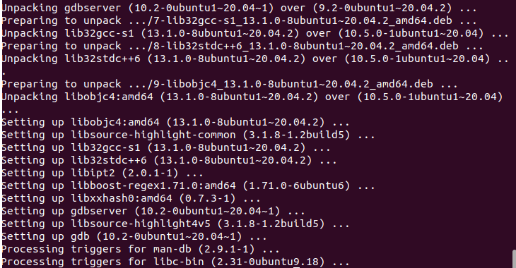

 Step 2: Clone the Repositories
Install OpenROAD-flow scripts (wrapper for Yosys, OpenROAD, etc.):

git clone --recursive https://github.com/The-OpenROAD-Project/OpenROAD-flow-scripts.git
cd OpenROAD-flow-scripts


Step 3: Run the Setup Script
Run the setup installer (this installs all required third-party libraries):
  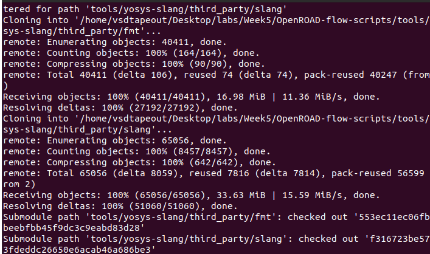
```bash  
sudo ./setup.sh
```
This step sets up everything OpenROAD depends on — including Boost, SWIG, Abseil, and more.

Step 4: Build OpenROAD Locally
Now build OpenROAD itself using the automated build script:
```bash
./build_openroad.sh --local
```
💡 This step takes about 30–45 minutes depending on cores and RAM.

  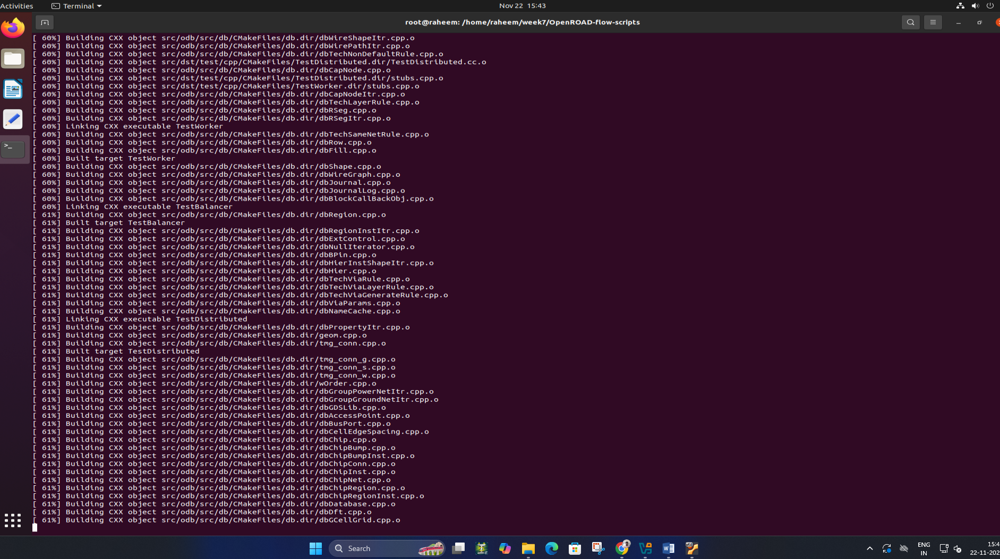

  If tests fail to build (common Google Test issue), you can skip them:
```bash
./build_openroad.sh --local --disable-tests
```
 

Step 5: Verify Installation
source ./env.sh
yosys -help  
openroad -help
yosys --version
openroad --version
verilator --version

 

Step 6: Run the OpenROAD Flow
cd flow
```bash
make
```
 

Step 7. Launch the graphical user interface (GUI) to visualize the final layout
```bash
 make gui_final
```
  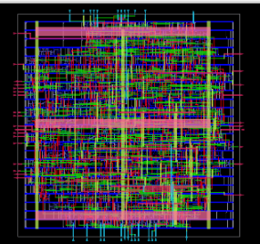

Installation Complete! You can now explore the full RTL-to-GDSII flow using OpenROAD.

ORFS Directory Structure and File formats
OpenROAD-flow-scripts/

├── OpenROAD-flow-scripts             
│   ├── docker           -> It has Docker based installation, run scripts and all saved here
│   ├── docs             -> Documentation for OpenROAD or its flow scripts.  
│   ├── flow             -> Files related to run RTL to GDS flow  
|   ├── jenkins          -> It contains the regression test designed for each build update
│   ├── tools            -> It contains all the required tools to run RTL to GDS flow
│   ├── etc              -> Has the dependency installer script and other things
│   ├── setup_env.sh     -> Its the source file to source all our OpenROAD rules to run the RTL to GDS 

  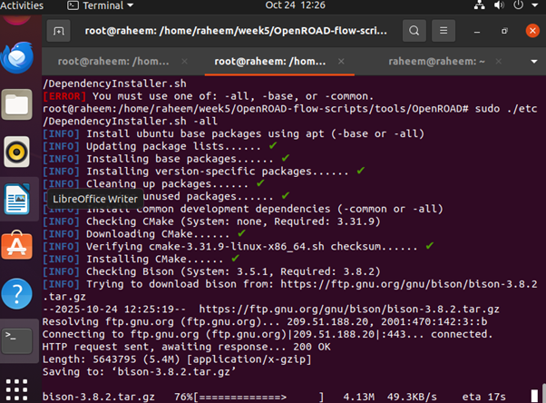

  Inside the flow/ Directory

├── flow           
│   ├── design           -> It has built-in examples from RTL to GDS flow across different technology nodes
│   ├── makefile         -> The automated flow runs through makefile setup
│   ├── platform         -> It has different technology note libraries, lef files, GDS etc 
|   ├── tutorials        
│   ├── util            
│   ├── scripts                 

  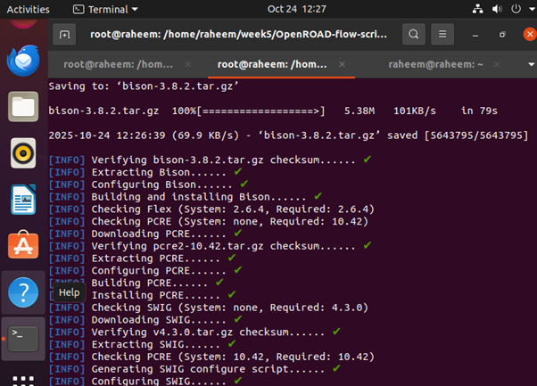

  Floorplan and Placement of VSDBabySoC in OpenROAD
RTL2GDS Flow for VSDBabySoC: Initial Steps
1.	Create Directories:
o	Inside OpenROAD-flow-scripts/flow/designs/sky130hd/, create a folder named vsdbabysoc.
o	Create another folder named vsdbabysoc in OpenROAD-flow-scripts/flow/designs/src/ and place all Verilog files here.
2.	Copy Folders:
o	From your VSDBabySoC folder, copy the following folders into sky130hd/vsdbabysoc:
	gds: Contains avsddac.gds, avsdpll.gds.
	include: Contains sandpiper.vh, sandpiper_gen.vh, sp_default.vh, sp_verilog.vh.
	lef: Contains avsddac.lef, avsdpll.lef.
	lib: Contains avsddac.lib, avsdpll.lib.
3.	Copy Constraint and Configuration Files:
o	Copy vsdbabysoc_synthesis.sdc into sky130hd/vsdbabysoc.
o	Copy macro.cfg and pin_order.cfg into sky130hd/vsdbabysoc.
4.	Create Config File:
o	Create a config.mk file in sky130hd/vsdbabysoc with the required configuration details.
config.mk
   # Design and Platform Configuration
   export DESIGN_NICKNAME = vsdbabysoc
   export DESIGN_NAME = vsdbabysoc
   export PLATFORM    = sky130hd

  # Design Paths
  export vsdbabysoc_DIR = /home/raheem/Desktop/VLSI/OpenROAD-flow-scripts/flow/designs/sky130hd/$(DESIGN_NICKNAME)

  # Explicitly list Verilog files for synthesis
   export VERILOG_FILES = /home/raheem/Desktop/VLSI/OpenROAD-flow-scripts/flow/designs/src/vsdbabysoc/vsdbabysoc.v \
                         /home/raheem/Desktop/VLSI/OpenROAD-flow-scripts/flow/designs/src/vsdbabysoc/rvmyth.v \
                         /home/raheem/Desktop/VLSI/OpenROAD-flow-scripts/flow/designs/src/vsdbabysoc/clk_gate.v


  # Include Directory for Verilog Header Files
   export VERILOG_INCLUDE_DIRS = $(vsdbabysoc_DIR)/include

  # Constraints File
    export SDC_FILE = $(vsdbabysoc_DIR)/vsdbabysoc_synthesis.sdc

  # Additional GDS Files
    export ADDITIONAL_GDS = $(vsdbabysoc_DIR)/gds/avsddac.gds \
                            $(vsdbabysoc_DIR)/gds/avsdpll.gds

  # Additional LEF Files
   export ADDITIONAL_LEFS = $(vsdbabysoc_DIR)/lef/avsddac.lef \
                            $(vsdbabysoc_DIR)/lef/avsdpll.lef

  # Additional LIB Files
   export ADDITIONAL_LIBS = $(vsdbabysoc_DIR)/lib/avsddac.lib \
                            $(vsdbabysoc_DIR)/lib/avsdpll.lib

 # Pin Order and Macro Placement Configurations
   export FP_PIN_ORDER_CFG = $(vsdbabysoc_DIR)/pin_order.cfg
   export MACRO_PLACEMENT_CFG = $(vsdbabysoc_DIR)/macro.cfg

 # Clock Configuration
   export CLOCK_PORT = CLK
   export CLOCK_NET  = $(CLOCK_PORT)
   export CLOCK_PERIOD = 20.0

# Floorplanning Configuration
  export DIE_AREA   = 0 0 1600 1600
  export CORE_AREA  = 10 10 1590 1590

# Routing Configuration
export GRT_ALLOW_CONGESTION = 1
export GRT_ADJUSTMENT = 0.2
export GLOBAL_ROUTE_ARGS = -allow_congestion -verbose

# Skip the optimization step that is causing the crash.
# (The log showed it was doing 0 repairs anyway).
export SKIP_INCREMENTAL_REPAIR = 1

# Forces standard cells to stay 20 microns away from macros
export MACRO_PLACE_HALO = 20 20

# Increase the spacing (pitch) between Horizontal Power Straps (Met5)
# The default is usually around 180. We increase it to create gaps.
export FP_PDN_HPITCH = 200

# Routing Configuration
export MAX_ROUTING_LAYER = met4

# Placement Configuration
  export PLACE_PINS_ARGS = -exclude left:0-400 -exclude left:1200-1600

# Tuning for Timing and Buffers
  export TNS_END_PERCENT     = 95
  export REMOVE_ABC_BUFFERS  = 1
  export CTS_BUF_DISTANCE    = 300
  export SKIP_GATE_CLONING   = 1

 # Magic Tool Configuration
   export MAGIC_ZEROIZE_ORIGIN = 0
   export MAGIC_EXT_USE_GDS    = 1

This script sets up environment variables and configurations for the design and synthesis of a System-on-Chip (SoC) using the OpenROAD flow. The design is based on the "vsdbabysoc" and targets the "sky130hd" platform.
________________________________________
Key Components of config.mk
Design and Platform Configuration
	DESIGN_NICKNAME & DESIGN_NAME: Both are set to "vsdbabysoc," serving as the identifier for the design project.
	PLATFORM: Specifies the technology platform as "sky130hd," indicating the process node and design rules to be used.
Design Paths
	vsdbabysoc_DIR: Defines the directory path for the design files as /home/raheem/Desktop/VLSI/OpenROAD-flow-scripts/flow/designs/sky130hd/vsdbabysoc. This path is constructed using the DESIGN_NICKNAME variable, ensuring consistency and easy access to design resources.
Verilog Files for Synthesis
	VERILOG_FILES: Lists the Verilog source files required for synthesis:
o	/home/raheem/Desktop/VLSI/OpenROAD-flow-scripts/flow/designs/src/vsdbabysoc/vsdbabysoc.v: The main Verilog file for the SoC design.
o	/home/raheem/Desktop/VLSI/OpenROAD-flow-scripts/flow/designs/src/vsdbabysoc/rvmyth.v: A module within the design, possibly a RISC-V core or related component.
o	/home/raheem/Desktop/VLSI/OpenROAD-flow-scripts/flow/designs/src/vsdbabysoc/clk_gate.v: A module for clock gating, used to manage power consumption by controlling clock signals.
Verilog Header Files
	VERILOG_INCLUDE_DIRS: Specifies the directory for Verilog header files as /home/raheem/Desktop/VLSI/OpenROAD-flow-scripts/flow/designs/sky130hd/vsdbabysoc/include.
 Constraints and Additional Files
	SDC_FILE: Points to the constraints file for synthesis located at /home/raheem/Desktop/VLSI/OpenROAD-flow-scripts/flow/designs/sky130hd/vsdbabysoc/vsdbabysoc_synthesis.sdc.
	ADDITIONAL_GDS: Lists additional GDS files required for the design:
	/home/raheem/Desktop/VLSI/OpenROAD-flow-scripts/flow/designs/sky130hd/vsdbabysoc/gds/avsddac.gds
	/home/raheem/Desktop/VLSI/OpenROAD-flow-scripts/flow/designs/sky130hd/vsdbabysoc/gds/avsdpll.gds
	ADDITIONAL_LEFS: Lists additional LEF files:
	/home/raheem/Desktop/VLSI/OpenROAD-flow-scripts/flow/designs/sky130hd/vsdbabysoc/lef/avsddac.lef
	/home/raheem/Desktop/VLSI/OpenROAD-flow-scripts/flow/designs/sky130hd/vsdbabysoc/lef/avsdpll.lef
	ADDITIONAL_LIBS: Lists additional LIB files:
	/home/raheem/Desktop/VLSI/OpenROAD-flow-scripts/flow/designs/sky130hd/vsdbabysoc/lib/avsddac.lib
	/home/raheem/Desktop/VLSI/OpenROAD-flow-scripts/flow/designs/sky130hd/vsdbabysoc/lib/avsdpll.lib
Pin Order and Macro Placement
	FP_PIN_ORDER_CFG: Configuration file for pin order located at /home/raheem/Desktop/VLSI/OpenROAD-flow-scripts/flow/designs/sky130hd/vsdbabysoc/pin_order.cfg.
	MACRO_PLACEMENT_CFG: Configuration file for macro placement located at /home/raheem/Desktop/VLSI/OpenROAD-flow-scripts/flow/designs/sky130hd/vsdbabysoc/macro.cfg.
Clock Configuration
	CLOCK_PORT & CLOCK_NET: Defines the clock port and net as CLK.
	CLOCK_PERIOD: Sets the clock period to 20.0 units.
Floorplanning Configuration
	DIE_AREA: Specifies the die area dimensions as 0 0 1600 1600.
	CORE_AREA: Specifies the core area dimensions as 20 20 1590 1590.
Placement Configuration
	PLACE_PINS_ARGS: Arguments for pin placement, excluding certain areas on the die:
o	-exclude left:0-600
o	-exclude left:1000-1600
o	-exclude right:*
o	-exclude top:*
o	-exclude bottom:*
Timing and Buffer Tuning
•	TNS_END_PERCENT: Sets the target negative slack end percentage to 100.
•	REMOVE_ABC_BUFFERS: Enables removal of ABC buffers, set to 1.
•	CTS_BUF_DISTANCE: Sets the buffer distance for clock tree synthesis to 600.
•	SKIP_GATE_CLONING: Skips gate cloning during synthesis, set to 1.
Magic Tool Configuration
•	MAGIC_ZEROIZE_ORIGIN: Configuration for zeroizing the origin, set to 0.
•	MAGIC_EXT_USE_GDS: Configuration for using GDS files, set to 1.
This setup script is crucial for defining the environment and parameters needed for successful synthesis and layout of the "vsdbabysoc" design on the "sky130hd" platform, ensuring that all necessary files and configurations are in place for the design flow.
Macro Configuration File Documentation
The macro.cfg file defines the placement coordinates and orientation for hardware macros in a chip design layout, typically used in VLSI/ASIC design flows.
File Format
Each line in the configuration file follows this syntax pattern:
<macro_name> <x_coordinate> <y_coordinate> <orientation>
Configuration Breakdown
PLL Macro
pll 200 950 N
•	Macro Name: pll (Phase-Locked Loop)
•	X Coordinate: 200 (horizontal placement position)
•	Y Coordinate: 950 (vertical placement position)
•	Orientation: N (North - standard upright orientation)
The PLL is a critical clock generation and management circuit positioned at coordinates (200, 950) with standard North orientation.
DAC Macro
dac 150 250 MY
•	Macro Name: dac (Digital-to-Analog Converter)
•	X Coordinate: 150 (horizontal placement position)
•	Y Coordinate: 250 (vertical placement position)
•	Orientation: MY (Mirror Y - flipped along the Y-axis)
The DAC macro handles digital-to-analog conversion and is placed at coordinates (150, 250) with Y-axis mirroring applied.
Orientation Values
Common orientation flags include:
•	N: North (0° rotation, standard)
•	S: South (180° rotation)
•	E: East (90° clockwise)
•	W: West (90° counter-clockwise)
•	MY: Mirror Y-axis
•	MX: Mirror X-axis
Usage
This configuration file is typically consumed by place-and-route tools during the physical design phase to ensure proper macro placement and avoid routing congestion.
Edit global_route.tcl
The Fix: Comment Out the "Extra" Optimizations Since we cannot disable this step via config.mk, we must comment it out in the Tcl script. You don't need Power Recovery for this design anyway.
Step 1: Open the Script Open the file global_route.tcl in your text editor. (It is likely located at flow/scripts/global_route.tcl or inside your scripts folder).
Step 2: Comment Out Power Recovery Find the section that looks like this (around line 100-110) and add # to the start of every line to disable it:
# ----------------- COMMENT THIS BLOCK OUT -----------------
# log_cmd global_route -start_incremental
# recover_power_helper
# # Route the modified nets by rsz journal restore
# log_cmd global_route -end_incremental {*}$res_aware \
#   -congestion_report_file $::env(REPORTS_DIR)/congestion_post_recover_power.rpt
# -----------------------------------------------------------
global_route.tcl
  utl::set_metrics_stage "globalroute__{}"
  source $::env(SCRIPTS_DIR)/load.tcl
  erase_non_stage_variables grt
  load_design 4_cts.odb 4_cts.sdc
  
  # This proc is here to allow us to use 'return' to return early from this
  # file which is sourced
  proc global_route_helper { } {
    source_env_var_if_exists PRE_GLOBAL_ROUTE_TCL

 set res_aware ""
 append_env_var res_aware ENABLE_RESISTANCE_AWARE -resistance_aware 0

 proc do_global_route { res_aware } {
   set all_args [concat [list \
     -congestion_report_file $::global_route_congestion_report] \
     $::env(GLOBAL_ROUTE_ARGS) {*}$res_aware]

   log_cmd global_route {*}$all_args
 }
 set additional_args ""
 append_env_var additional_args dbProcessNode -db_process_node 1
 append_env_var additional_args VIA_IN_PIN_MIN_LAYER -via_in_pin_bottom_layer 1
 append_env_var additional_args VIA_IN_PIN_MAX_LAYER -via_in_pin_top_layer 1

 pin_access {*}$additional_args

 set result [catch { do_global_route $res_aware } errMsg]

 if { $result != 0 } {
   if { !$::env(GENERATE_ARTIFACTS_ON_FAILURE) } {
     write_db $::env(RESULTS_DIR)/5_1_grt-failed.odb
     error $errMsg
   }
   write_sdc -no_timestamp $::env(RESULTS_DIR)/5_1_grt.sdc
   write_db $::env(RESULTS_DIR)/5_1_grt.odb
   return
 }

 set_placement_padding -global \
   -left $::env(CELL_PAD_IN_SITES_DETAIL_PLACEMENT) \
   -right $::env(CELL_PAD_IN_SITES_DETAIL_PLACEMENT)

 set_propagated_clock [all_clocks]
 estimate_parasitics -global_routing

 if { [env_var_exists_and_non_empty DONT_USE_CELLS] } {
   set_dont_use $::env(DONT_USE_CELLS)
 }

 if { !$::env(SKIP_INCREMENTAL_REPAIR) } {
   if { $::env(DETAILED_METRICS) } {
     report_metrics 5 "global route pre repair design"
   }

# Repair design using global route parasitics
repair_design_helper
if { $::env(DETAILED_METRICS) } {
  report_metrics 5 "global route post repair design"
}

# Running DPL to fix overlapped instances
# Run to get modified net by DPL
log_cmd global_route -start_incremental
log_cmd detailed_placement
# Route only the modified net by DPL
log_cmd global_route -end_incremental {*}$res_aware \
  -congestion_report_file $::env(REPORTS_DIR)/congestion_post_repair_design.rpt

# Repair timing using global route parasitics
puts "Repair setup and hold violations..."
estimate_parasitics -global_routing

repair_timing_helper

if { $::env(DETAILED_METRICS) } {
  report_metrics 5 "global route post repair timing"
}

# Running DPL to fix overlapped instances
# Run to get modified net by DPL
log_cmd global_route -start_incremental
log_cmd detailed_placement
# Route only the modified net by DPL
log_cmd global_route -end_incremental {*}$res_aware \
  -congestion_report_file $::env(REPORTS_DIR)/congestion_post_repair_timing.rpt
 }


  #  log_cmd global_route -start_incremental
  #  recover_power_helper
 # Route the modified nets by rsz journal restore
  #  log_cmd global_route -end_incremental {*}$res_aware \
-congestion_report_file $::env(REPORTS_DIR)/congestion_post_recover_power.rpt

 if {
   !$::env(SKIP_ANTENNA_REPAIR) &&
   [env_var_exists_and_non_empty MAX_REPAIR_ANTENNAS_ITER_GRT]
 } {
puts "Repair antennas..."
repair_antennas -iterations $::env(MAX_REPAIR_ANTENNAS_ITER_GRT)
check_placement -verbose
check_antennas -report_file $::env(REPORTS_DIR)/grt_antennas.log
 }

 puts "Estimate parasitics..."
 estimate_parasitics -global_routing

 report_metrics 5 "global route"

 # Write SDC to results with updated clock periods that are just failing.
 # Use make target update_sdc_clock to install the updated sdc.
 source [file join $::env(SCRIPTS_DIR) "write_ref_sdc.tcl"]

 write_guides $::env(RESULTS_DIR)/route.guide
 write_db $::env(RESULTS_DIR)/5_1_grt.odb
 write_sdc -no_timestamp $::env(RESULTS_DIR)/5_1_grt.sdc
  }

  global_route_helper
Another Fix thanks to the @BitopanBaishya
He modified the macro_place_util.tcl file so that it reads the macro.cfg as follows:
He replaced
log_cmd rtl_macro_placer {*}$all_args
with
  # Manual macro placement using macro.cfg
if { [env_var_exists_and_non_empty MACRO_PLACEMENT_CFG] } {

set fp [open $::env(MACRO_PLACEMENT_CFG) r]
while {[gets $fp line] >= 0} {
# skip empty and comment lines
if {[regexp {^\s*$} $line]} continue
if {[regexp {^#} $line]} continue

# Parse: <macro> <x> <y> <orient>
scan $line "%s %f %f %s" macro x y orient

puts "Placing macro $macro at ($x, $y) orient $orient"
place_macro -macro_name $macro -location "$x $y" -orientation $orient
}
close $fp
}
File Structure After Setup
raheem@raheem:~/Desktop/VLSI/OpenROAD-flow-scripts/flow/designs/src/vsdbabysoc$ ls -ltrh
total 3.1M
-rw-rw-r-- 1 raheem raheem  590 Nov 13 20:54 vsdbabysoc.v
-rwxrwxr-x 1 raheem raheem 1.3K Nov 13 20:54 testbench.v
-rw-rw-r-- 1 raheem raheem  603 Nov 13 20:54 testbench.rvmyth.post-routing.v
-rw-rw-r-- 1 raheem raheem 1.7K Nov 13 20:54 clk_gate.v
-rw-rw-r-- 1 raheem raheem  947 Nov 13 20:54 avsdpll.v
-rw-rw-r-- 1 raheem raheem 1.1K Nov 13 20:54 avsddac.v
-rw-rw-r-- 1 raheem raheem  17K Nov 13 21:00 rvmyth.v
-rw-rw-r-- 1 raheem raheem  19K Nov 13 21:00 rvmyth_gen.v
-rw-rw-r-- 1 raheem raheem  50K Nov 13 21:21 primitives.v -> /home/raheem/Desktop/VLSI/VLSI/sky130RTLDesignAndSynthesisWorkshop/my_lib/verilog_model/primitives.v
-rw-rw-r-- 1 raheem raheem 749K Nov 13 21:22 vsdbabysoc.synth.v
-rw-rw-r-- 1 raheem raheem 2.3M Nov 13 21:29 sky130_fd_sc_hd.v
raheem@raheem:~/Desktop/VLSI/OpenROAD-flow-scripts/flow/designs/sky130hd/vsdbabysoc$ ls -ltrh
total 32K
-rw-rw-r-- 1 raheem raheem   73 Nov 13 20:54 vsdbabysoc_synthesis.sdc
-rw-rw-r-- 1 raheem raheem   62 Nov 13 20:54 pin_order.cfg -> /home/raheem/Desktop/VLSI/VSDBabySoC/src/layout_conf/vsdbabysoc/pin_order.cfg
-rw-rw-r-- 1 raheem raheem   28 Nov 13 20:54 macro.cfg -> /home/raheem/Desktop/VLSI/VSDBabySoC/src/layout_conf/vsdbabysoc/macro.cfg
drwxrwxr-x 2 raheem raheem 4.0K Nov 13 20:54 lef
drwxrwxr-x 2 raheem raheem 4.0K Nov 13 20:54 include
drwxrwxr-x 2 raheem raheem 4.0K Nov 13 20:54 gds
-rw-rw-r-- 1 raheem raheem 2.2K Nov 15 18:45 config.mk
drwxrwxr-x 2 raheem raheem 4.0K Nov 15 18:59 lib
Now go to terminal and run the following commands:
# Navigate to the OpenROAD flow scripts directory
cd OpenROAD-flow-scripts
# Source the environment setup script
source env.sh
# Change to the flow directory
cd flow
  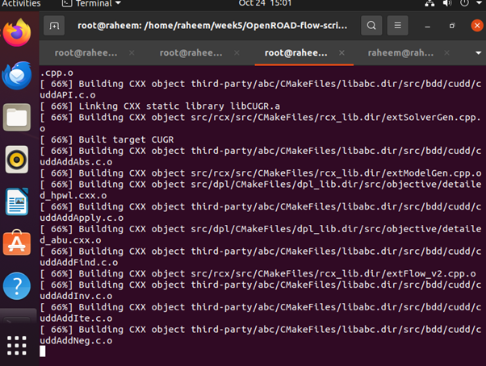

Run Synthesis
# Ensure you are in the 'flow' directory before running the synthesis command
make DESIGN_CONFIG=./designs/sky130hd/vsdbabysoc/config.mk clean_all
make DESIGN_CONFIG=./designs/sky130hd/vsdbabysoc/config.mk synth
This command runs the synthesis process using the specified design configuration file config.mk for the vsdbabysoc design on the sky130hd platform.
 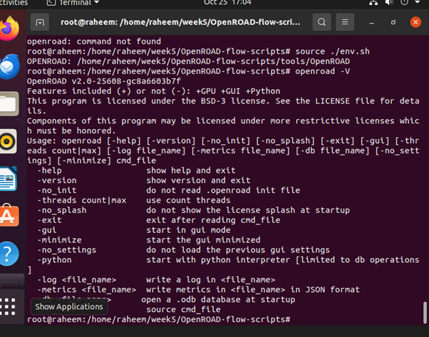
  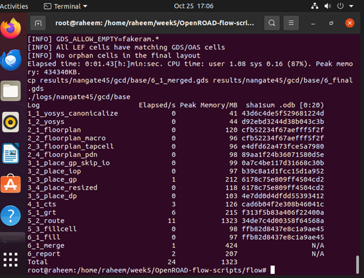

Synthesis netlist
~/OpenROAD-flow-scripts/flow$ gvim results/sky130hd/vsdbabysoc/base/1_1_yosys.v
  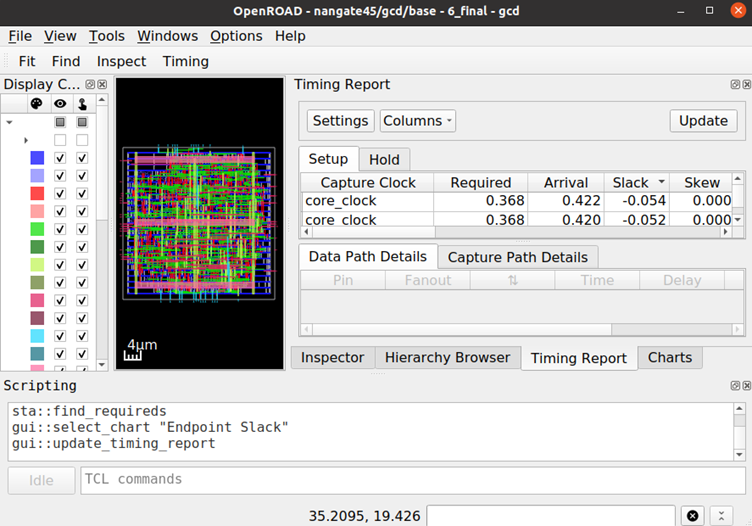
  Synthesis Stats
~/OpenROAD-flow-scripts/flow$ gvim reports/sky130hd/vsdbabysoc/base/synth_stat.txt
  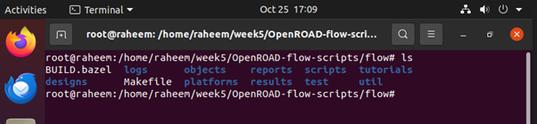
  Run Floorplan
make DESIGN_CONFIG=./designs/sky130hd/vsdbabysoc/config.mk floorplan
  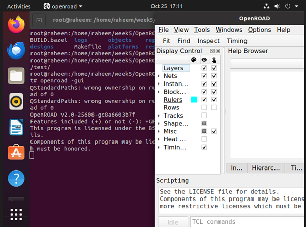
  This command initiates the floorplanning process for the vsdbabysoc design using the specified configuration file config.mk on the sky130hd platform.

Floorplan Error and Fix
❗Note: You may encounter the following error:

[ERROR STA-0164] .../vsdbabysoc/lib/avsdpll.lib line 54, syntax error
Error: floorplan.tcl, 4 STA-0164
Fix: This error is caused by commented block structures in your Liberty file avsdpll.lib. OpenROAD’s parser does not tolerate partially commented blocks like:

//pin (GND#2) {
//  direction : input;
//  max_transition : 2.5;
//  capacitance : 0.001;
//}
✅ To fix it, simply delete the entire commented block starting at line 54:

After saving the changes, re-run the floorplan step and the flow should proceed without syntax errors.

Floorplan Result (GUI)
make DESIGN_CONFIG=./designs/sky130hd/vsdbabysoc/config.mk gui_floorplan
  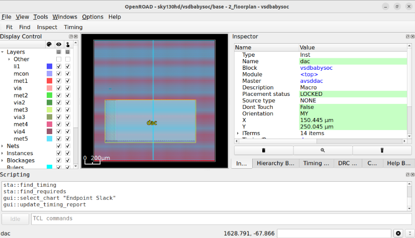
    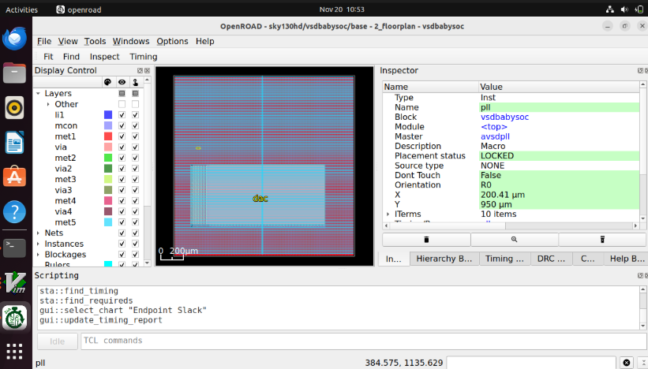

Run Placement
make DESIGN_CONFIG=./designs/sky130hd/vsdbabysoc/config.mk place
This command executes the placement process for the vsdbabysoc design, utilizing the configuration file config.mk on the sky130hd platform to arrange the circuit components optimally within the defined floorplan.
    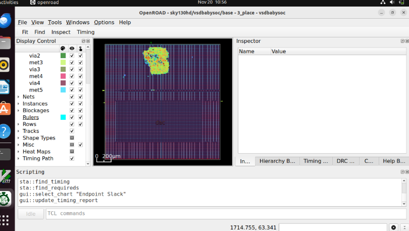

Placement Result (GUI)
make DESIGN_CONFIG=./designs/sky130hd/vsdbabysoc/config.mk gui_place
 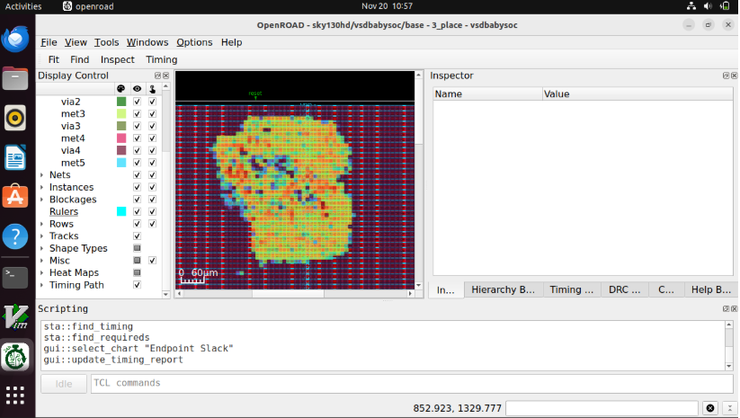

To view the Placement Density heatmap in OpenROAD:

Go to Tools → Heat maps → Placement Density → ✓ Show numbers
 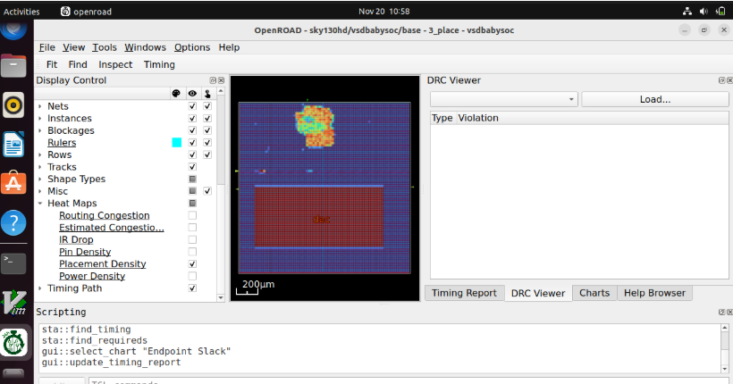

run cts
make DESIGN_CONFIG=./designs/sky130hd/vsdbabysoc/config.mk cts
 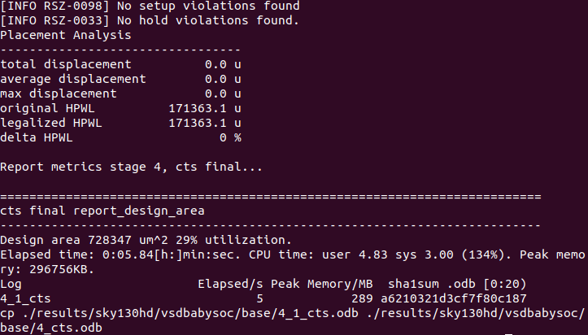
CTS Result (GUI)

make DESIGN_CONFIG=./designs/sky130hd/vsdbabysoc/config.mk gui_cts
This image shows the Clock Tree Synthesis (CTS) stage, highlighting a placed clock buffer (clkbuf_leaf_209_CLK) with its properties displayed in the Inspector, including position, orientation, and connectivity details.
 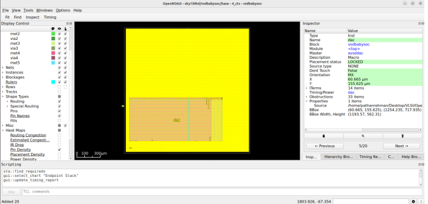
This image shows the Clock Tree Viewer after CTS, illustrating the clock buffer distribution on the layout and a histogram of clock insertion delays, indicating balanced clock skew across the sinks.
 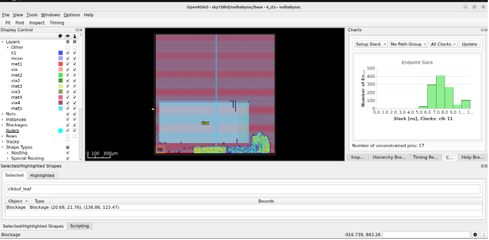
This image shows the Setup Timing Report, presenting a list of timing paths with key metrics such as:

Required Time
Arrival Time
Slack
Skew
Logic Delay
Logic Depth
Fanout
All paths have positive slack, confirming that the design meets setup timing requirements.
 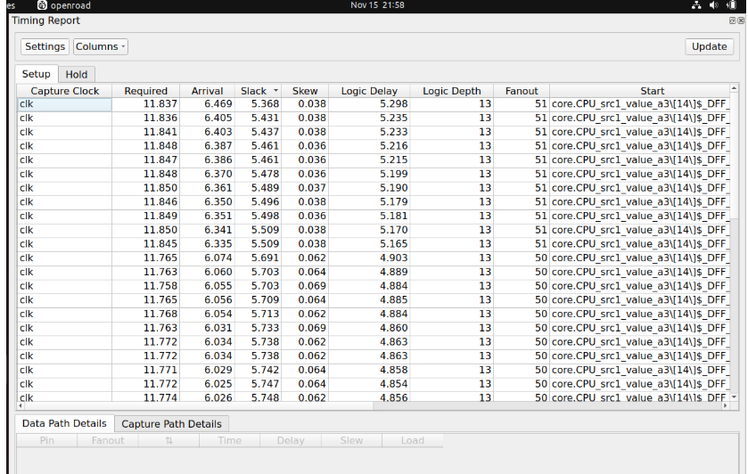

This image displays the Hold Timing Report, showing timing paths with details such as:

Required Time
Arrival Time
Slack
Skew
Logic Delay
Fanout
All paths listed have positive slack, indicating that the design meets hold timing requirements and is free from hold violations.
 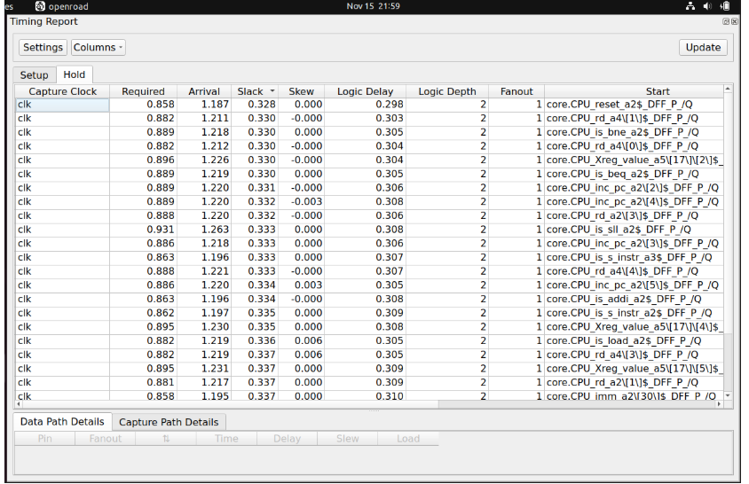
This image shows the Setup Slack Histogram after CTS. The histogram represents the distribution of endpoint slack values, all of which are positive, indicating that there are no setup timing violations.
 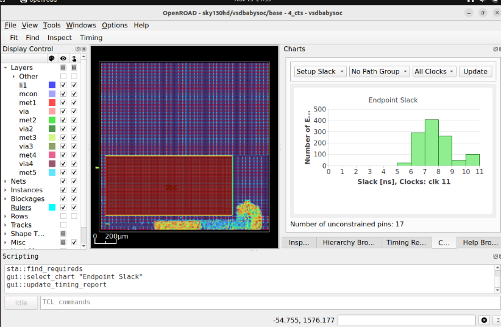
This image shows the Hold Slack Histogram after CTS. The histogram represents the distribution of hold slack values for all endpoints. All values are positive, confirming that the design meets hold timing requirements without any violations.

 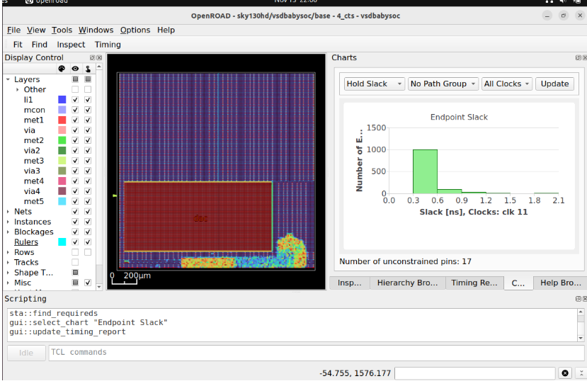
Zoomed-in view of the design after CTS, showing inserted clock buffers and routing connections.
 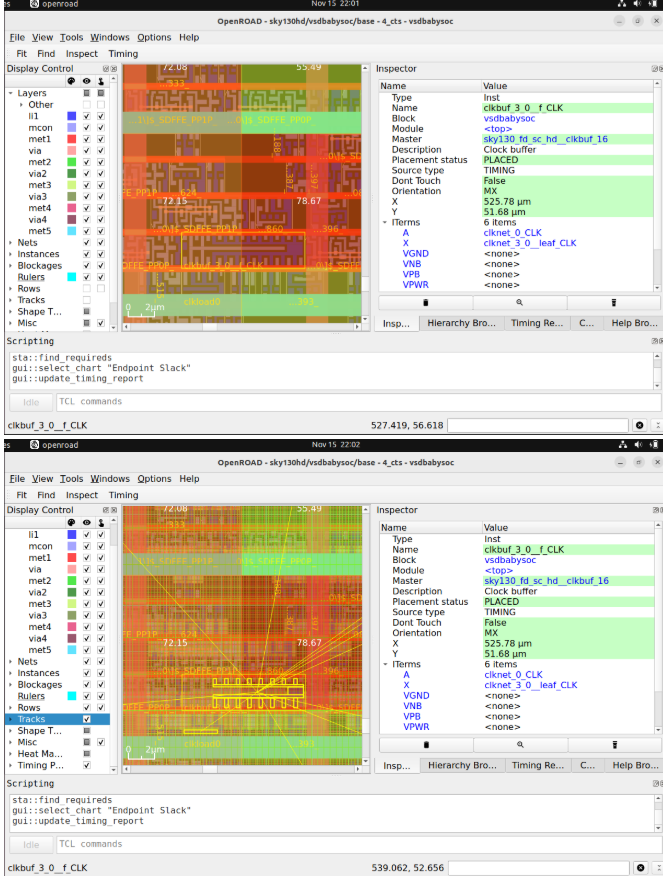
CTS final report:

gvim /home/raheem/Desktop/VLSI/OpenROAD-flow-scripts/flow/reports/sky130hd/vsdbabysoc/base/4_cts_final.rpt
4_cts_final.rpt
run routing
make DESIGN_CONFIG=./designs/sky130hd/vsdbabysoc/config.mk route
 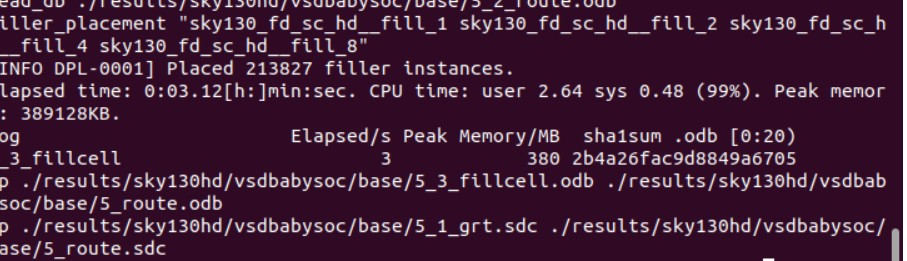
 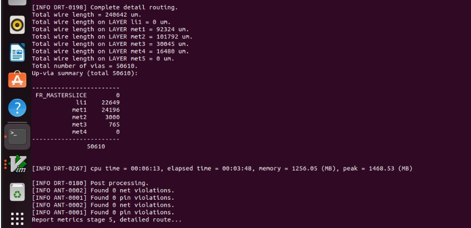
 Routing Result (GUI)

make DESIGN_CONFIG=./designs/sky130hd/vsdbabysoc/config.mk gui_route
This image shows the post-routing stage. The highlighted net VCO_IN is fully routed, with its details such as signal type, wire type, and bounding box displayed in the Inspector.
 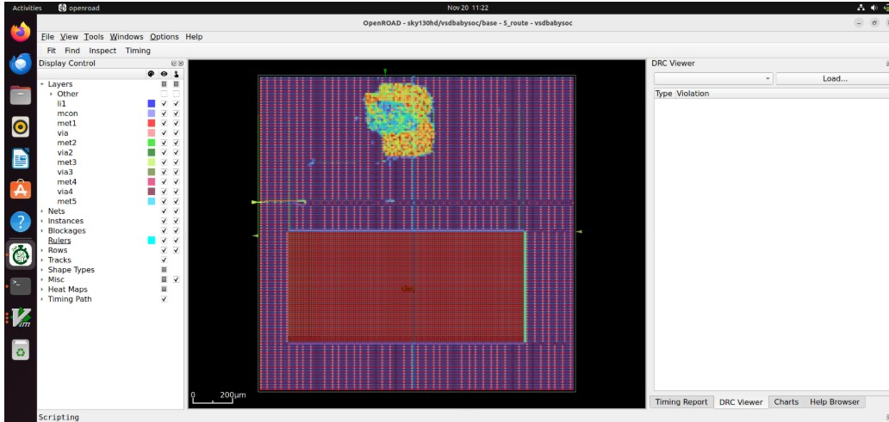
 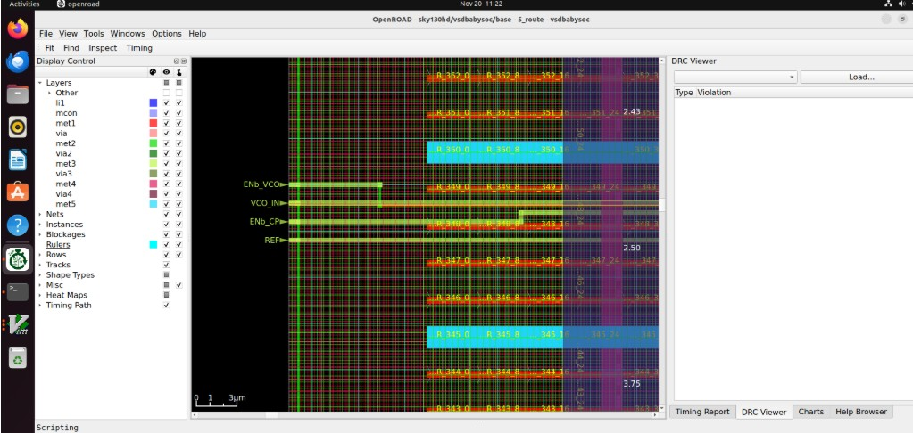
 This image shows the Routing Congestion Heatmap after the routing stage. Areas with higher congestion are highlighted in red, while green regions indicate lower congestion. The highlighted net _01595_ is fully routed, and its properties such as bounding box and connectivity details are shown in the Inspector.
 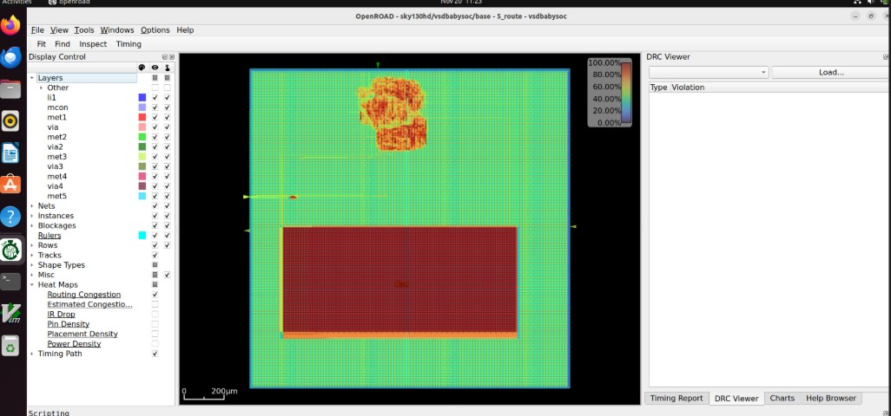
Formula for Congestion:
The routing congestion percentage is calculated as:

Congestion (%) = (Used Routing Tracks ÷ Available Routing Tracks) × 100

Where:

Used Routing Tracks = Number of tracks occupied by wires in a specific region.
Available Routing Tracks = Total routing capacity of that region.
Techniques to Reduce Routing Congestion:
Increase Core Area / Die Size

Enlarging the die provides more routing tracks and reduces congestion.
Adjust Placement Density

Lower the target density during placement to leave whitespace for routing.
Add Placement Blockages

Create routing blockages or halos around macros to avoid routing choke points.
Cell Padding

Add extra spacing between standard cells to reduce local congestion.
Macro Repositioning

Move large macros toward the periphery and keep enough channel spacing.
Use Higher Metal Layers

Assign global nets or critical signals to higher metal layers for better routing resources.
Routing Layer Adjustment

Allow more routing layers in congested designs.
Congestion-Driven Placement

Enable congestion-aware algorithms during placement in the EDA tool.
Timing Report after Routing:
After completing routing, run the following in the OpenROAD GUI → Scripting window:

report_checks
This command provides a detailed timing analysis of critical paths.

In the example below, the design meets timing with Slack = 5.94 ns (MET)
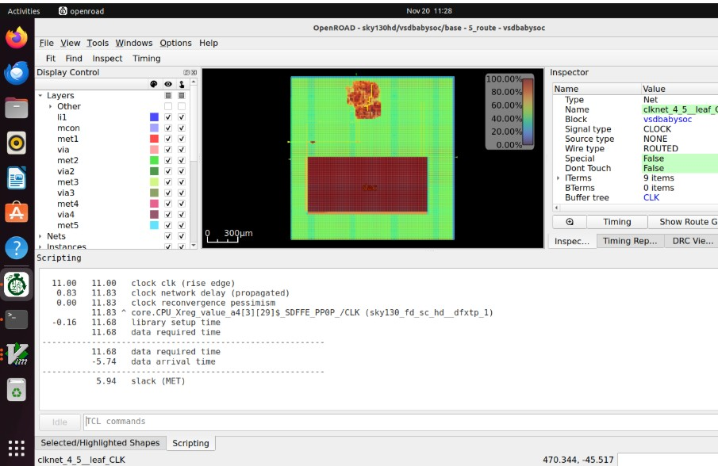
The image shows various log and JSON files generated by the OpenROAD flow for each stage (e.g., floorplan, placement, CTS, routing, and filler cell insertion). These files provide detailed execution reports and design data for debugging and analysis.
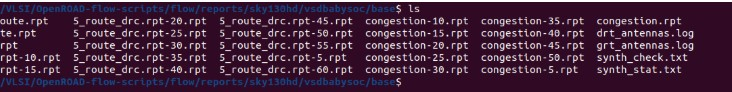
 Convert .odb to .def in OpenROAD
Follow the steps below to export a DEF file from an existing OpenDB (.odb) database.

cd ~/OpenROAD-flow-scripts
source env.sh
cd flow
openroad
# Load the .odb database file
read_db /home/raheem/Desktop/VLSI/OpenROAD-flow-scripts/flow/results/sky130hd/vsdbabysoc/base/5_2_route.odb
# Write out the DEF file
write_def /home/raheem/Desktop/VLSI/OpenROAD-flow-scripts/flow/results/sky130hd/vsdbabysoc/base/5_2_route.def
gvim /home/raheem/Desktop/VLSI/OpenROAD-flow-scripts/flow/results/sky130hd/vsdbabysoc/base/5_2_route.def
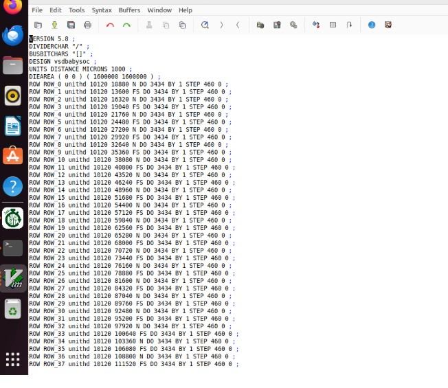

VSDBabySoC post_route SPEF generation
This section covers the step-by-step procedure to generate the post-route Standard Parasitic Exchange Format (SPEF) and post-placement Verilog netlist for the VSDBabySoC design using OpenROAD. These outputs are essential for accurate timing analysis and signoff after the routing stage. The SPEF file captures parasitic RC effects from the physical layout, while the updated Verilog reflects the final net connections post-placement and routing.

Step 1: Launch OpenROAD
Before starting OpenROAD, set up the environment and navigate to the flow directory:

cd ~/OpenROAD-flow-scripts
source env.sh
cd flow/
openroad
Step 2: Load Design and Technology Files
Once inside the OpenROAD shell, run the following commands in sequence to load the required design and technology data for VSDBabySoC:

These files describe the physical dimensions and metal/via layers for standard cells and macros:

read_lef /home/raheem/Desktop/VLSI/OpenROAD-flow-scripts/flow/designs/sky130hd/vsdbabysoc/lef/sky130hd.lef
read_lef /home/raheem/Desktop/VLSI/OpenROAD-flow-scripts/flow/designs/sky130hd/vsdbabysoc/lef/avsdpll.lef
read_lef /home/raheem/Desktop/VLSI/OpenROAD-flow-scripts/flow/designs/sky130hd/vsdbabysoc/lef/avsddac.lef
This file contains timing and power data for the standard cells:

read_liberty /home/raheem/Desktop/VLSI/OpenROAD-flow-scripts/flow/platforms/sky130hd/lib/sky130_fd_sc_hd__tt_025C_1v80.lib
The DEF file represents the post-route physical layout of the design:

read_def /home/raheem/Desktop/VLSI/OpenROAD-flow-scripts/flow/results/sky130hd/vsdbabysoc/base/5_2_route.def

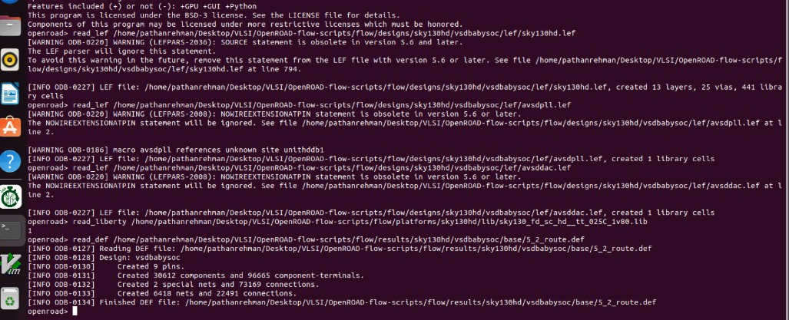

Step 3: RC Extraction and Output Generation
After loading the LEF, Liberty, and DEF files, run the following commands to define the process corner and extract parasitics using the available .calibre-format model:

🔹 1. Define Process Corner
Set the process corner using the available Calibre-based extraction rules file:

define_process_corner -ext_model_index 0 /home/raheem/Desktop/VLSI/OpenROAD-flow-scripts/external-resources/open_pdks/sky130/openlane/rules.openrcx.sky130A.nom.calibre
🔹 2. Extract Parasitics
Run parasitic extraction using the same file:

extract_parasitics -ext_model_file /home/raheem/Desktop/VLSI/OpenROAD-flow-scripts/external-resources/open_pdks/sky130/openlane/rules.openrcx.sky130A.nom.calibre
🔹 3. Write SPEF File
Save the extracted parasitics:

write_spef /home/raheem/Desktop/VLSI/OpenROAD-flow-scripts/flow/designs/sky130hd/vsdbabysoc/vsdbabysoc.spef
🔹 4. Write Post-Placement Verilog Netlist
Save the netlist after placement and routing:
```bash
write_verilog /home/raheem/Desktop/VLSI/OpenROAD-flow-scripts/flow/designs/sky130hd/vsdbabysoc/vsdbabysoc_post_place.v
```


The Standard Parasitic Exchange Format (SPEF) file captures the resistance and capacitance (RC) parasitics of interconnects extracted from the routed layout. This file is essential for accurate post-route static timing analysis (STA) as it models real-world wire delays caused by metal layers and vias. Tools like OpenSTA read the SPEF file to compute timing paths that reflect true physical behavior after routing. Generating and inspecting the SPEF ensures that your design is signoff-ready with precise timing estimates.
```
gvim /home/raheem/Desktop/VLSI/OpenROAD-flow-scripts/flow/designs/sky130hd/vsdbabysoc/vsdbabysoc.spef
```
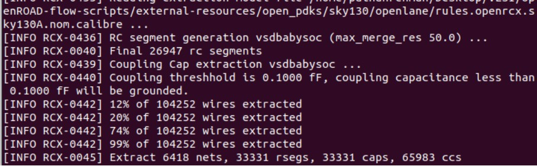
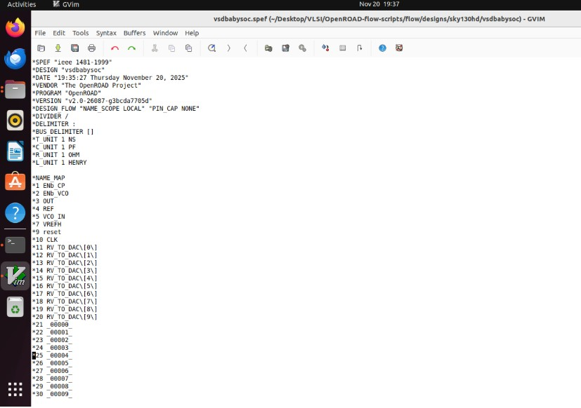

The post-placement Verilog netlist represents the logical connectivity of the design after placement and routing have been completed. This version of the netlist includes any modifications made by optimization or physical synthesis during the backend flow and ensures consistency with the final layout. It is used in downstream verification flows and enables correlation between logical simulation and physical implementation. Writing this netlist is crucial for timing closure and for validating the final connectivity of the design.
```bash
gvim /home/raheem/Desktop/VLSI/OpenROAD-flow-scripts/flow/designs/sky130hd/vsdbabysoc/vsdbabysoc_post_place.v
```
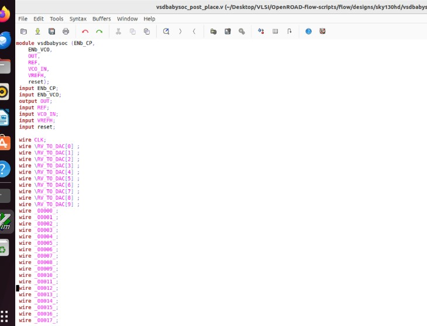

Thanks you VSD Team 
